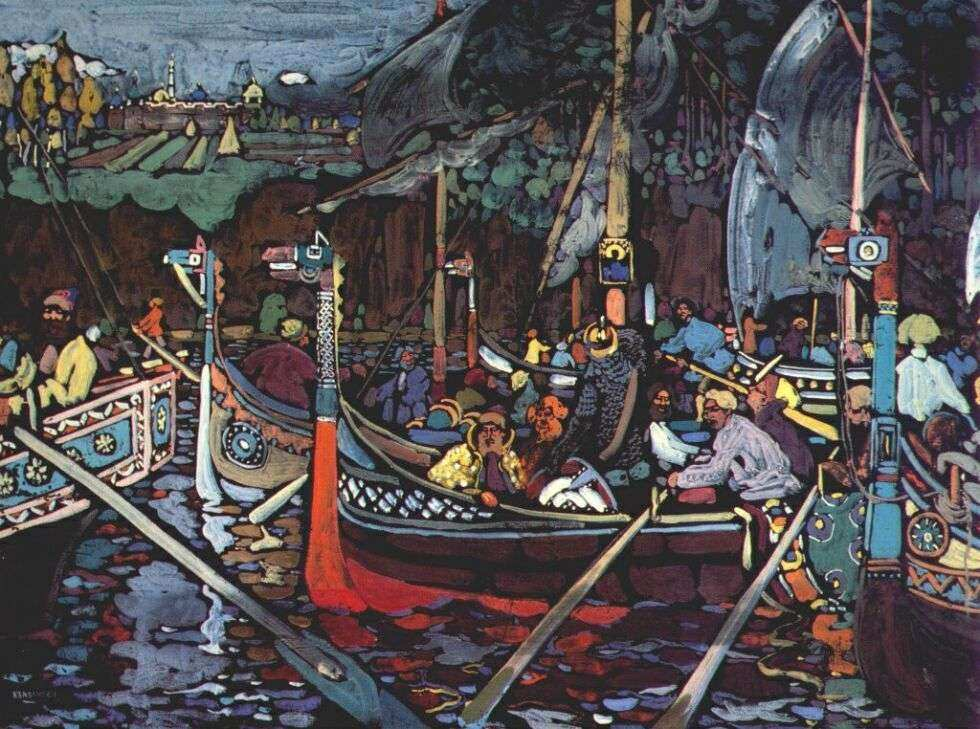

[🏠 Home](../../index.md)

# November 15

## 🧑‍🎨 Painting of the day

[Vasiliy Kandinskiy](http://en.wikipedia.org/wiki/Wassily_Kandinsky) (Expressionism, Abstractionism)

<button class="btn btn-success"
onclick=" window.open('https://lens.google.com/uploadbyurl?url=https://iretes.github.io/one-a-day/data/img/Vasiliy_Kandinskiy_1.jpg','_blank')">
Search with Google Lens
</button>

## 🎼 Song of the day

> *Dancing Barefoot*
by Patti Smith Group

 Written by Smith, Ivan Kral.

Released in May , 1979.

<button class="btn btn-success"
onclick=" window.open('http://www.youtube.com/search?q=Dancing Barefoot by Patti Smith Group','_blank')">
Search on YouTube
</button>

## 🏛️ UNESCO heritage site of the day

> *Historic Sanctuary of Machu Picchu*, Peru

Machu Picchu stands 2,430 m above sea-level, in the middle of a tropical mountain forest, in an extraordinarily beautiful setting. It was probably the most amazing urban creation of the Inca Empire at its height; its giant walls, terraces and ramps seem as if they have been cut naturally in the continuous rock escarpments. The natural setting, on the eastern slopes of the Andes, encompasses the upper Amazon basin with its rich diversity of flora and fauna.

<button class="btn btn-success"
onclick=" window.open('http://www.google.com/search?q=Historic Sanctuary of Machu Picchu','_blank')">
Search on Google
</button>

## 🗺️ Place of the day

<iframe
src="https://www.mapcrunch.com"
name="mapcrunch"
width="500"
height="500"
allowTransparency="true"
scrolling="no"
frameborder="0"
>
</iframe>
## 🎨 Color of the day

> *[Cadmium green](https://en.wikipedia.org/wiki/Cadmium_pigments)*

&#9632;

## 🌿 Plant of the day

> *pleurisy root*

<button class="btn btn-success"
onclick=" window.open('http://www.google.com/search?q=pleurisy root','_blank')">
Search on Google
</button>

## 🧑‍🔬 Scientific discovery of the day

> *499: Aryabhata creates a particularly accurate eclipse chart. As an example of its accuracy, 18th century scientist Guillaume Le Gentil, during a visit to Pondicherry, India, found the Indian computations (based on Aryabhata's computational paradigm) of the duration of the lunar eclipse of 30 August 1765 to be short by 41 seconds, whereas his charts (by Tobias Mayer, 1752) were long by 68 seconds.*

<button class="btn btn-success"
onclick=" window.open('http://www.google.com/search?q=499: Aryabhata creates a particularly accurate eclipse chart. As an example of its accuracy, 18th century scientist Guillaume Le Gentil, during a visit to Pondicherry, India, found the Indian computations (based on Aryabhata s computational paradigm) of the duration of the lunar eclipse of 30 August 1765 to be short by 41 seconds, whereas his charts (by Tobias Mayer, 1752) were long by 68 seconds.','_blank')">
Search on Google
</button>

## 💭 Philosophical concept of the day

> *[Entity](https://en.wikipedia.org/wiki/Non-physical_entity)*

## 🗣️ Saying of the day

> *Like being savaged by a dead sheep*

This was said by combative UK Labour politician Dennis Healey on being criticized by the mild mannered Tory minister Geoffrey Howe in the UK House of Commons in June 1978. 
