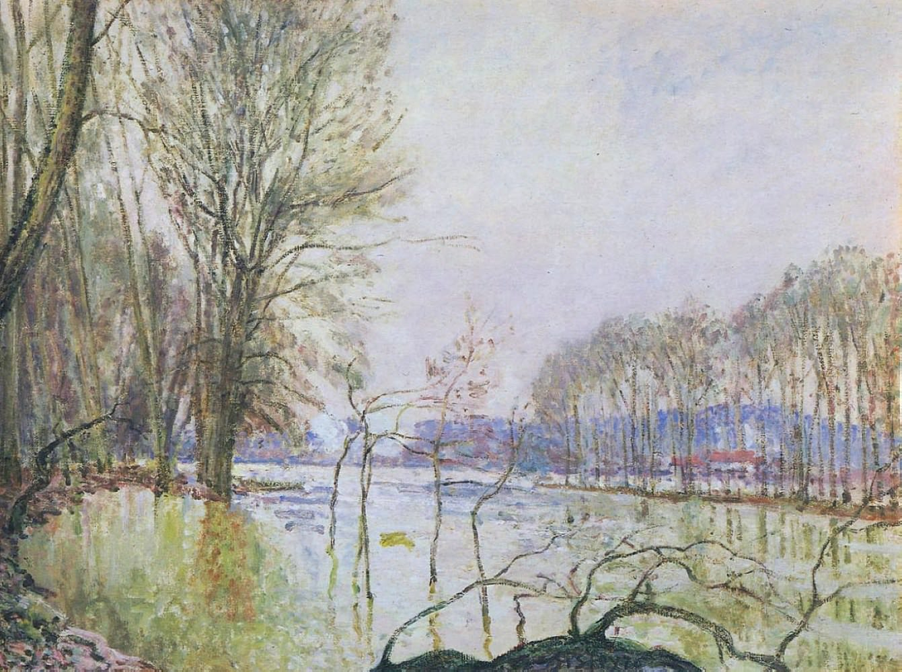

[🏠 Home](../../index.md)

# November 17

## 🧑‍🎨 Painting of the day

[Alfred Sisley](http://en.wikipedia.org/wiki/Alfred_Sisley) (Impressionism)

<button class="btn btn-success"
onclick=" window.open('https://lens.google.com/uploadbyurl?url=https://iretes.github.io/one-a-day/data/img/Alfred_Sisley_6.jpg','_blank')">
Search with Google Lens
</button>

## 🎼 Song of the day

> *Cortez the Killer*
by Neil Young

 Written by Young.

Released in Nov. , 1975.

<button class="btn btn-success"
onclick=" window.open('http://www.youtube.com/search?q=Cortez the Killer by Neil Young','_blank')">
Search on YouTube
</button>

## 🏛️ UNESCO heritage site of the day

> *Whale Sanctuary of El Vizcaino*, Mexico

Located in the central part of the peninsula of Baja California, the sanctuary contains some exceptionally interesting ecosystems. The coastal lagoons of Ojo de Liebre and San Ignacio are important reproduction and wintering sites for the grey whale, harbour seal, California sea lion, northern elephant-seal and blue whale. The lagoons are also home to four species of the endangered marine turtle.

<button class="btn btn-success"
onclick=" window.open('http://www.google.com/search?q=Whale Sanctuary of El Vizcaino','_blank')">
Search on Google
</button>

## 🗺️ Place of the day

<iframe
src="https://www.mapcrunch.com"
name="mapcrunch"
width="500"
height="500"
allowTransparency="true"
scrolling="no"
frameborder="0"
>
</iframe>
## 🎨 Color of the day

> *[Malachite](https://en.wikipedia.org/wiki/Shades_of_green#Malachite)*

&#9632;

## 🌿 Plant of the day

> *squaw bush*

<button class="btn btn-success"
onclick=" window.open('http://www.google.com/search?q=squaw bush','_blank')">
Search on Google
</button>

## 🧑‍🔬 Scientific discovery of the day

> *2nd century: Galen studies the anatomy of pigs.*

<button class="btn btn-success"
onclick=" window.open('http://www.google.com/search?q=2nd century: Galen studies the anatomy of pigs.','_blank')">
Search on Google
</button>

## 💭 Philosophical concept of the day

> *[Entertainment](https://en.wikipedia.org/wiki/Entertainment)*

## 🗣️ Saying of the day

> *Little pitchers have big ears*

This proverbial saying means 'be careful, children are listening'.

## 🏳️‍🌈 International day

World Day of Remembrance for Road Traffic Victims.