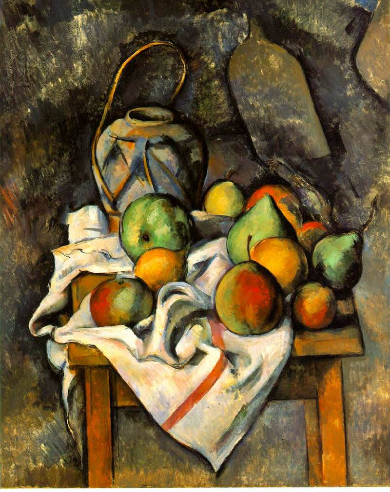

[🏠 Home](../../index.md)

# November 18

## 🧑‍🎨 Painting of the day

[Paul Cezanne](https://en.wikipedia.org/wiki/Paul_Cézanne) (Post-Impressionism)

<button class="btn btn-success"
onclick=" window.open('https://lens.google.com/uploadbyurl?url=https://iretes.github.io/one-a-day/data/img/Paul_Cezanne_3.jpg','_blank')">
Search with Google Lens
</button>

## 🎼 Song of the day

> *Heartbreaker*
by Led Zeppelin

 Written by Jimmy Page, Robert Plant, John Bonham, John Paul Jones.

Released in Oct. , 1969.

<button class="btn btn-success"
onclick=" window.open('http://www.youtube.com/search?q=Heartbreaker by Led Zeppelin','_blank')">
Search on YouTube
</button>

## 🏛️ UNESCO heritage site of the day

> *Tiya*, Ethiopia

Tiya is among the most important of the roughly 160 archaeological sites discovered so far in the Soddo region, south of Addis Ababa. The site contains 36 monuments, including 32 carved stelae covered with symbols, most of which are difficult to decipher. They are the remains of an ancient Ethiopian culture whose age has not yet been precisely determined.

<button class="btn btn-success"
onclick=" window.open('http://www.google.com/search?q=Tiya','_blank')">
Search on Google
</button>

## 🗺️ Place of the day

<iframe
src="https://www.mapcrunch.com"
name="mapcrunch"
width="500"
height="500"
allowTransparency="true"
scrolling="no"
frameborder="0"
>
</iframe>
## 🎨 Color of the day

> *[Melon](https://en.wikipedia.org/wiki/Shades_of_orange#Melon)*

&#9632;

## 🌿 Plant of the day

> *silver leaf maple*

<button class="btn btn-success"
onclick=" window.open('http://www.google.com/search?q=silver leaf maple','_blank')">
Search on Google
</button>

## 🧑‍🔬 Scientific discovery of the day

> *4th century BC: Pāṇini develops a full-fledged formal grammar (for Sanskrit).*

<button class="btn btn-success"
onclick=" window.open('http://www.google.com/search?q=4th century BC: Pāṇini develops a full-fledged formal grammar (for Sanskrit).','_blank')"> 
Search on Google
</button>

## 💭 Philosophical concept of the day

> *[Epistemic justification](https://en.wikipedia.org/wiki/Epistemic_justification)*

## 🗣️ Saying of the day

> *Nod - The land of*

The Land of Nod is a mythical  land where we travel to to sleep.

## 🏳️‍🌈 International day

World Antimicrobial Resistance Awareness Week (18-11 November), World Day for the Prevention of and Healing from Child Sexual Exploitation, Abuse and Violence.