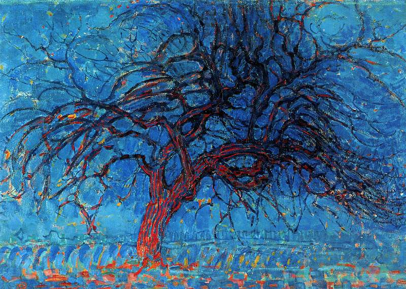

[🏠 Home](../../index.md)

# November 19

## 🧑‍🎨 Painting of the day

[Piet Mondrian](https://en.wikipedia.org/wiki/Piet_Mondrian) (Neoplasticism)

<button class="btn btn-success"
onclick=" window.open('https://lens.google.com/uploadbyurl?url=https://iretes.github.io/one-a-day/data/img/Piet_Mondrian_8.jpg','_blank')">
Search with Google Lens
</button>

## 🎼 Song of the day

> *Take Me Out*
by Franz Ferdinand

 Written by Alex Kapranos, Nick McCarthy.

Released in Feb. , 2004.

<button class="btn btn-success"
onclick=" window.open('http://www.youtube.com/search?q=Take Me Out by Franz Ferdinand','_blank')">
Search on YouTube
</button>

## 🏛️ UNESCO heritage site of the day

> *Churches and Convents of Goa*, India

The churches and convents of Goa, the former capital of the Portuguese Indies – particularly the Church of Bom Jesus, which contains the tomb of St Francis-Xavier – illustrate the evangelization of Asia. These monuments were influential in spreading forms of Manueline, Mannerist and Baroque art in all the countries of Asia where missions were established.

<button class="btn btn-success"
onclick=" window.open('http://www.google.com/search?q=Churches and Convents of Goa','_blank')">
Search on Google
</button>

## 🗺️ Place of the day

<iframe
src="https://www.mapcrunch.com"
name="mapcrunch"
width="500"
height="500"
allowTransparency="true"
scrolling="no"
frameborder="0"
>
</iframe>
## 🎨 Color of the day

> *[Kobi](https://en.wikipedia.org/wiki/Red-violet#Kobi)*

&#9632;

## 🌿 Plant of the day

> *spring cress*

<button class="btn btn-success"
onclick=" window.open('http://www.google.com/search?q=spring cress','_blank')">
Search on Google
</button>

## 🧑‍🔬 Scientific discovery of the day

> *1796: Georges Cuvier: Establishes extinction as a fact.*

<button class="btn btn-success"
onclick=" window.open('http://www.google.com/search?q=1796: Georges Cuvier: Establishes extinction as a fact.','_blank')"> 
Search on Google
</button>

## 💭 Philosophical concept of the day

> *[Immanent critique](https://en.wikipedia.org/wiki/Immanent_critique)*

## 🗣️ Saying of the day

> *The triumph of hope over experience*

A literal view of the subject of remarriage.

## 🏳️‍🌈 International day

World Toilet Day.