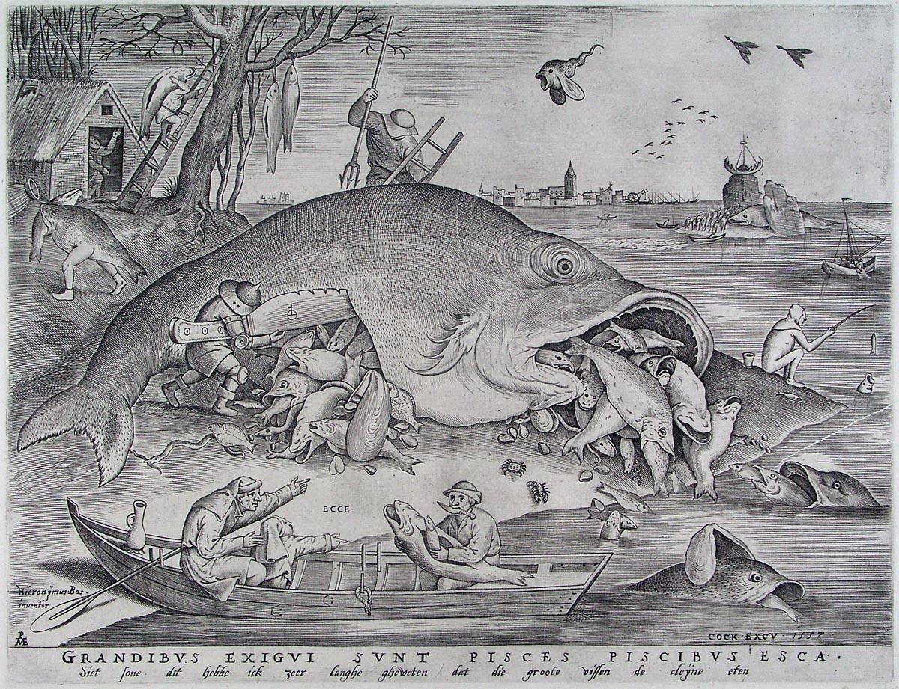

[🏠 Home](../../index.md)

# November 20

## 🧑‍🎨 Painting of the day

[Pieter Bruegel](http://en.wikipedia.org/wiki/Pieter_Bruegel_the_Elder) (Northern Renaissance)

<button class="btn btn-success"
onclick=" window.open('https://lens.google.com/uploadbyurl?url=https://iretes.github.io/one-a-day/data/img/Pieter_Bruegel_1.jpg','_blank')">
Search with Google Lens
</button>

## 🎼 Song of the day

> *Schools Out*
by Alice Cooper

 Written by Michael Bruce, Glen Buxton, Cooper, Dennis Dunway, Neal Smith.

Released in May , 1972.

<button class="btn btn-success"
onclick=" window.open('http://www.youtube.com/search?q=Schools Out by Alice Cooper','_blank')">
Search on YouTube
</button>

## 🏛️ UNESCO heritage site of the day

> *San Cristóbal de La Laguna*, Spain

San Crist&oacute;bal de La Laguna, in the Canary Islands, has two nuclei: the original, unplanned Upper Town; and the Lower Town, the first ideal 'city-territory' laid out according to philosophical principles. Its wide streets and open spaces have a number of fine churches and public and private buildings dating from the 16th to the 18th century.

<button class="btn btn-success"
onclick=" window.open('http://www.google.com/search?q=San Cristóbal de La Laguna','_blank')">
Search on Google
</button>

## 🗺️ Place of the day

<iframe
src="https://www.mapcrunch.com"
name="mapcrunch"
width="500"
height="500"
allowTransparency="true"
scrolling="no"
frameborder="0"
>
</iframe>
## 🎨 Color of the day

> *[Oxford blue](https://en.wikipedia.org/wiki/Oxford_Blue_(colour))*

&#9632;

## 🌿 Plant of the day

> *white maple*

<button class="btn btn-success"
onclick=" window.open('http://www.google.com/search?q=white maple','_blank')">
Search on Google
</button>

## 🧑‍🔬 Scientific discovery of the day

> *1662: Robert Boyle: Boyle's law of ideal gases.*

<button class="btn btn-success"
onclick=" window.open('http://www.google.com/search?q=1662: Robert Boyle: Boyle s law of ideal gases.','_blank')">
Search on Google
</button>

## 💭 Philosophical concept of the day

> *[Condition of possibility](https://en.wikipedia.org/wiki/Condition_of_possibility)*

## 🗣️ Saying of the day

> *Stark, raving mad*

Completely mad; delirious. 

## 🏳️‍🌈 International day

Africa Industrialization Day, World Children's Day.