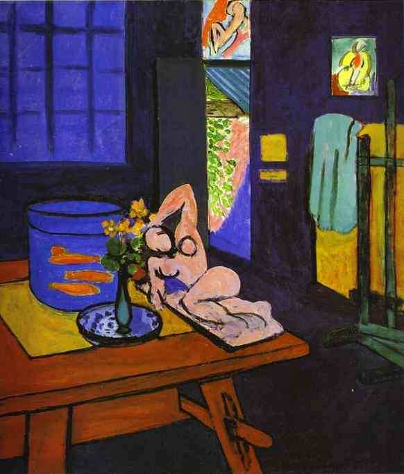

[🏠 Home](../../index.md)

# November 21

## 🧑‍🎨 Painting of the day

[Henri Matisse](http://en.wikipedia.org/wiki/Henri_Matisse) (Impressionism, Post-Impressionism)

<button class="btn btn-success"
onclick=" window.open('https://lens.google.com/uploadbyurl?url=https://iretes.github.io/one-a-day/data/img/Henri_Matisse_7.jpg','_blank')">
Search with Google Lens
</button>

## 🎼 Song of the day

> *Many Rivers to Cross*
by Jimmy Cliff

 Written by Cliff.

Released in Dec. , 1969.

<button class="btn btn-success"
onclick=" window.open('http://www.youtube.com/search?q=Many Rivers to Cross by Jimmy Cliff','_blank')">
Search on YouTube
</button>

## 🏛️ UNESCO heritage site of the day

> *Elephanta Caves*, India

The 'City of Caves', on an island in the Sea of Oman close to Bombay, contains a collection of rock art linked to the cult of Shiva. Here, Indian art has found one of its most perfect expressions, particularly the huge high reliefs in the main cave.

<button class="btn btn-success"
onclick=" window.open('http://www.google.com/search?q=Elephanta Caves','_blank')">
Search on Google
</button>

## 🗺️ Place of the day

<iframe
src="https://www.mapcrunch.com"
name="mapcrunch"
width="500"
height="500"
allowTransparency="true"
scrolling="no"
frameborder="0"
>
</iframe>
## 🎨 Color of the day

> *[B'dazzled blue](https://en.wikipedia.org/wiki/Sapphire_(color)#B&#39;dazzled_blue)*

&#9632;

## 🌿 Plant of the day

> *early winter cress*

<button class="btn btn-success"
onclick=" window.open('http://www.google.com/search?q=early winter cress','_blank')">
Search on Google
</button>

## 🧑‍🔬 Scientific discovery of the day

> *3rd century BC: Archimedes uses the method of exhaustion to construct a strict inequality bounding the value of π within an interval of 0.002.*

<button class="btn btn-success"
onclick=" window.open('http://www.google.com/search?q=3rd century BC: Archimedes uses the method of exhaustion to construct a strict inequality bounding the value of π within an interval of 0.002.','_blank')"> 
Search on Google
</button>

## 💭 Philosophical concept of the day

> *[Regress argument](https://en.wikipedia.org/wiki/Regress_argument)*

## 🗣️ Saying of the day

> *Middle of the road*

Something unadventurous or inoffensive; opting to go neither one way or the other.

## 🏳️‍🌈 International day

World Philosophy Day, World Television Day.