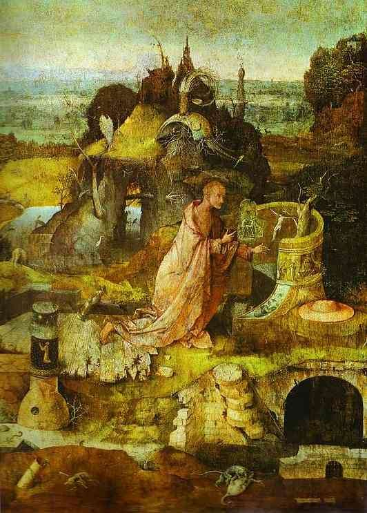

[🏠 Home](../../index.md)

# November 23

## 🧑‍🎨 Painting of the day

[Hieronymus Bosch](http://en.wikipedia.org/wiki/Hieronymus_Bosch) (Northern Renaissance)

<button class="btn btn-success"
onclick=" window.open('https://lens.google.com/uploadbyurl?url=https://iretes.github.io/one-a-day/data/img/Hieronymus_Bosch_6.jpg','_blank')">
Search with Google Lens
</button>

## 🎼 Song of the day

> *Alison*
by Elvis Costello

 Written by Costello.

Released in Nov. , 1977.

<button class="btn btn-success"
onclick=" window.open('http://www.youtube.com/search?q=Alison by Elvis Costello','_blank')">
Search on YouTube
</button>

## 🏛️ UNESCO heritage site of the day

> *Historic Centre of Cordoba*, Spain

Cordoba's period of greatest glory began in the 8th century after the Moorish conquest, when some 300 mosques and innumerable palaces and public buildings were built to rival the splendours of Constantinople, Damascus and Baghdad. In the 13th century, under Ferdinand III, the Saint, Cordoba's Great Mosque was turned into a cathedral and new defensive structures, particularly the Alcázar de los Reyes Cristianos and the Torre Fortaleza de la Calahorra, were erected.

<button class="btn btn-success"
onclick=" window.open('http://www.google.com/search?q=Historic Centre of Cordoba','_blank')">
Search on Google
</button>

## 🗺️ Place of the day

<iframe
src="https://www.mapcrunch.com"
name="mapcrunch"
width="500"
height="500"
allowTransparency="true"
scrolling="no"
frameborder="0"
>
</iframe>
## 🎨 Color of the day

> *[Hot magenta](https://en.wikipedia.org/wiki/Shades_of_magenta#Hot_magenta)*

&#9632;

## 🌿 Plant of the day

> *bitter nightshade*

<button class="btn btn-success"
onclick=" window.open('http://www.google.com/search?q=bitter nightshade','_blank')">
Search on Google
</button>

## 🧑‍🔬 Scientific discovery of the day

> *By the 5th century: The decimal separator is developed in India, as recorded in al-Uqlidisi's later commentary on Indian mathematics.*

<button class="btn btn-success"
onclick=" window.open('http://www.google.com/search?q=By the 5th century: The decimal separator is developed in India, as recorded in al-Uqlidisi s later commentary on Indian mathematics.','_blank')">
Search on Google
</button>

## 💭 Philosophical concept of the day

> *[Style](https://en.wikipedia.org/wiki/Style_(visual_arts))*

## 🗣️ Saying of the day

> *Something old, something new, something borrowed, something blue*

The collection of items that is considered lucky for a bride to take to her wedding.
