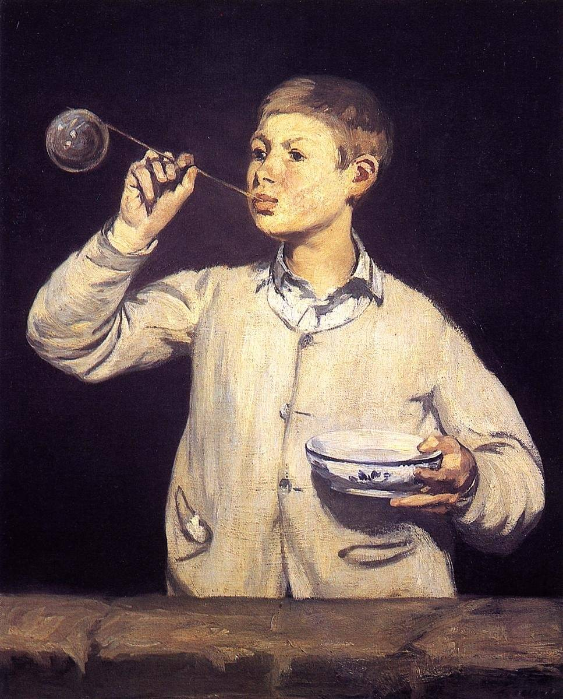

[🏠 Home](../../index.md)

# November 24

## 🧑‍🎨 Painting of the day

[Edouard Manet](http://en.wikipedia.org/wiki/Édouard_Manet) (Realism, Impressionism)

<button class="btn btn-success"
onclick=" window.open('https://lens.google.com/uploadbyurl?url=https://iretes.github.io/one-a-day/data/img/Edouard_Manet_4.jpg','_blank')">
Search with Google Lens
</button>

## 🎼 Song of the day

> *Dont Let Me Be Misunderstood*
by The Animals

 Written by Bennie Benjamin, Sol Marcus,Gloria Caldwell.

Released in Jan. , 1965.

<button class="btn btn-success"
onclick=" window.open('http://www.youtube.com/search?q=Dont Let Me Be Misunderstood by The Animals','_blank')">
Search on YouTube
</button>

## 🏛️ UNESCO heritage site of the day

> *Durham Castle and Cathedral*, United Kingdom of Great Britain and Northern Ireland

Durham Cathedral was built in the late 11th and early 12th centuries to house the relics of St Cuthbert (evangelizer of Northumbria) and the Venerable Bede. It attests to the importance of the early Benedictine monastic community and is the largest and finest example of Norman architecture in England. The innovative audacity of its vaulting foreshadowed Gothic architecture. Behind the cathedral stands the castle, an ancient Norman fortress which was the residence of the prince-bishops of Durham.

<button class="btn btn-success"
onclick=" window.open('http://www.google.com/search?q=Durham Castle and Cathedral','_blank')">
Search on Google
</button>

## 🗺️ Place of the day

<iframe
src="https://www.mapcrunch.com"
name="mapcrunch"
width="500"
height="500"
allowTransparency="true"
scrolling="no"
frameborder="0"
>
</iframe>
## 🎨 Color of the day

> *[Tart Orange](https://en.wikipedia.org/wiki/List_of_Crayola_crayon_colors#Heads_&#39;n_Tails)*

&#9632;

## 🌿 Plant of the day

> *cornel*

<button class="btn btn-success"
onclick=" window.open('http://www.google.com/search?q=cornel','_blank')">
Search on Google
</button>

## 🧑‍🔬 Scientific discovery of the day

> *2020: DeepMind solves the protein folding problem to 90 percent accuracy, a 50-year-old grand challenge, at CASP14.*

<button class="btn btn-success"
onclick=" window.open('http://www.google.com/search?q=2020: DeepMind solves the protein folding problem to 90 percent accuracy, a 50-year-old grand challenge, at CASP14.','_blank')">
Search on Google
</button>

## 💭 Philosophical concept of the day

> *[Love](https://en.wikipedia.org/wiki/Love)*

## 🗣️ Saying of the day

> *Hocus pocus*

'Hocus pocus' is a  supposed magical charm previously uttered by magicians. More recently it has been used as a general term for trickery or magic.
