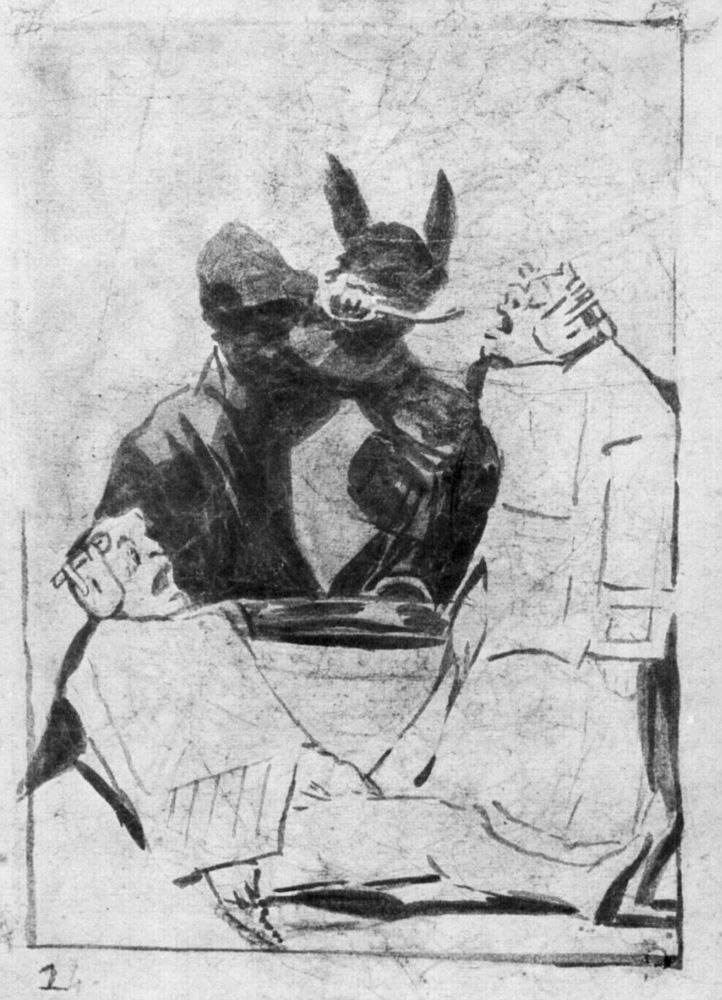

[🏠 Home](../../index.md)

# November 25

## 🧑‍🎨 Painting of the day

[Francisco Goya](http://en.wikipedia.org/wiki/Francisco_Goya) (Romanticism)

<button class="btn btn-success"
onclick=" window.open('https://lens.google.com/uploadbyurl?url=https://iretes.github.io/one-a-day/data/img/Francisco_Goya_7.jpg','_blank')">
Search with Google Lens
</button>

## 🎼 Song of the day

> *Comfortably Numb*
by Pink Floyd

 Written by David Gilmour, Roger Waters.

Released in Dec. , 1979.

<button class="btn btn-success"
onclick=" window.open('http://www.youtube.com/search?q=Comfortably Numb by Pink Floyd','_blank')">
Search on YouTube
</button>

## 🏛️ UNESCO heritage site of the day

> *Twyfelfontein or /Ui-//aes*, Namibia

Twyfelfontein or /Ui-//aes has one of the largest concentrations of [...] petroglyphs, i.e. rock engravings in Africa. Most of these well-preserved engravings represent rhinoceros, . The site also includes six painteelephant, ostrich and giraffe, as well as drawings of human and animal footprintsd rock shelters with motifs of human figures in red ochre. The objects excavated from two sections, date from the Late Stone Age. The site forms a coherent, extensive and high-quality record of ritual practices relating to hunter-gatherer communities in this part of southern Africa over at least 2,000 years, and eloquently illustrates the links between the ritual and economic practices of hunter-gatherers.

<button class="btn btn-success"
onclick=" window.open('http://www.google.com/search?q=Twyfelfontein or /Ui-//aes','_blank')">
Search on Google
</button>

## 🗺️ Place of the day

<iframe
src="https://www.mapcrunch.com"
name="mapcrunch"
width="500"
height="500"
allowTransparency="true"
scrolling="no"
frameborder="0"
>
</iframe>
## 🎨 Color of the day

> *[Metallic Sunburst](https://en.wikipedia.org/wiki/List_of_Crayola_crayon_colors#Metallic_FX)*

&#9632;

## 🌿 Plant of the day

> *cursed thistle*

<button class="btn btn-success"
onclick=" window.open('http://www.google.com/search?q=cursed thistle','_blank')">
Search on Google
</button>

## 🧑‍🔬 Scientific discovery of the day

> *1945: Howard Florey Mass production of penicillin*

<button class="btn btn-success"
onclick=" window.open('http://www.google.com/search?q=1945: Howard Florey Mass production of penicillin','_blank')">
Search on Google
</button>

## 💭 Philosophical concept of the day

> *[Tantra](https://en.wikipedia.org/wiki/Tantra)*

## 🗣️ Saying of the day

> *You can lead a horse to water but you can't make it drink*

People, like horses, will only do what they have a mind to do. 

## 🏳️‍🌈 International day

International Day for the Elimination of Violence against Women.