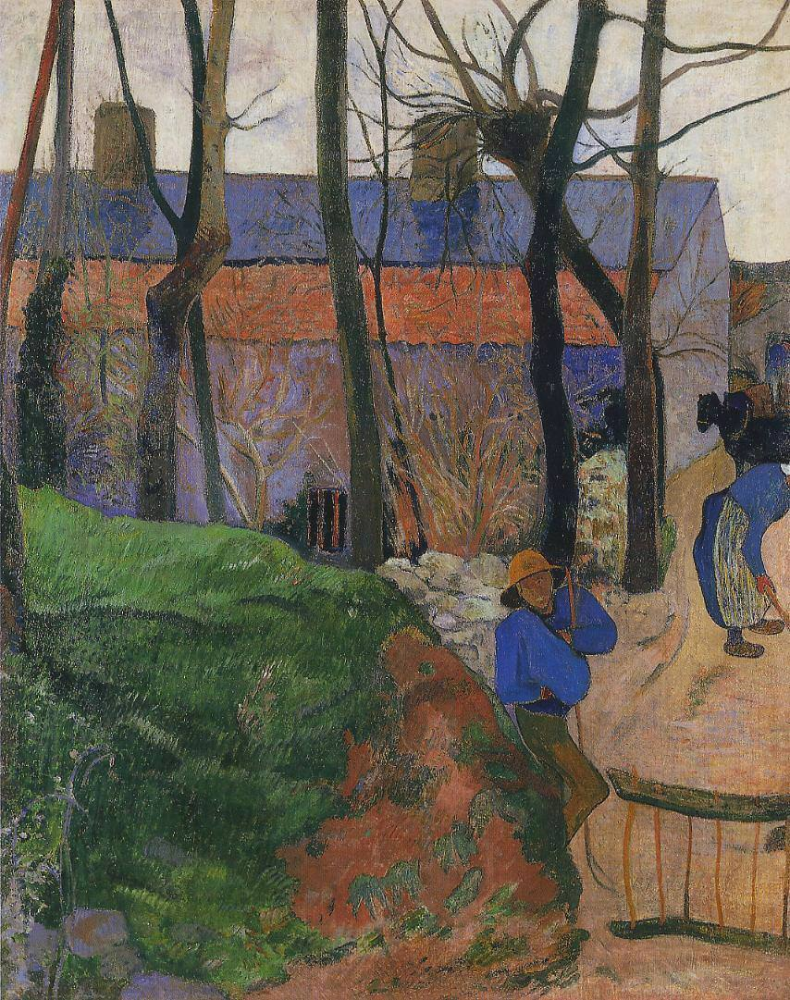

[🏠 Home](../../index.md)

# November 26

## 🧑‍🎨 Painting of the day

[Paul Gauguin](http://en.wikipedia.org/wiki/Paul_Gauguin) (Symbolism, Post-Impressionism)

<button class="btn btn-success"
onclick=" window.open('https://lens.google.com/uploadbyurl?url=https://iretes.github.io/one-a-day/data/img/Paul_Gauguin_4.jpg','_blank')">
Search with Google Lens
</button>

## 🎼 Song of the day

> *I Put a Spell on You*
by Screamin' Jay Hawkins

 Written by Screamin’ Jay Hawkins, Herb Slotkin.

Released in Sept. , 1956.

<button class="btn btn-success"
onclick=" window.open('http://www.youtube.com/search?q=I Put a Spell on You by Screamin  Jay Hawkins','_blank')">
Search on YouTube
</button>

## 🏛️ UNESCO heritage site of the day

> *Río Plátano Biosphere Reserve*, Honduras

Located on the watershed of the R&iacute;o Pl&aacute;tano, the reserve is one of the few remains of a tropical rainforest in Central America and has an abundant and varied plant and wildlife. In its mountainous landscape sloping down to the Caribbean coast, over 2,000 indigenous people have preserved their traditional way of life.

<button class="btn btn-success"
onclick=" window.open('http://www.google.com/search?q=Río Plátano Biosphere Reserve','_blank')">
Search on Google
</button>

## 🗺️ Place of the day

<iframe
src="https://www.mapcrunch.com"
name="mapcrunch"
width="500"
height="500"
allowTransparency="true"
scrolling="no"
frameborder="0"
>
</iframe>
## 🎨 Color of the day

> *[Blue bell](https://en.wikipedia.org/wiki/List_of_Crayola_crayon_colors#Standard_colors)*

&#9632;

## 🌿 Plant of the day

> *tuber root*

<button class="btn btn-success"
onclick=" window.open('http://www.google.com/search?q=tuber root','_blank')">
Search on Google
</button>

## 🧑‍🔬 Scientific discovery of the day

> *1861: Louis Pasteur: Germ theory.*

<button class="btn btn-success"
onclick=" window.open('http://www.google.com/search?q=1861: Louis Pasteur: Germ theory.','_blank')">
Search on Google
</button>

## 💭 Philosophical concept of the day

> *[Anthropic principle](https://en.wikipedia.org/wiki/Anthropic_principle)*

## 🗣️ Saying of the day

> *Jack in the box*

A toy consisting of a box containing a figure with a spring, which leaps up when the lid is raised. 

## 🏳️‍🌈 International day

World Sustainable Transport Day.