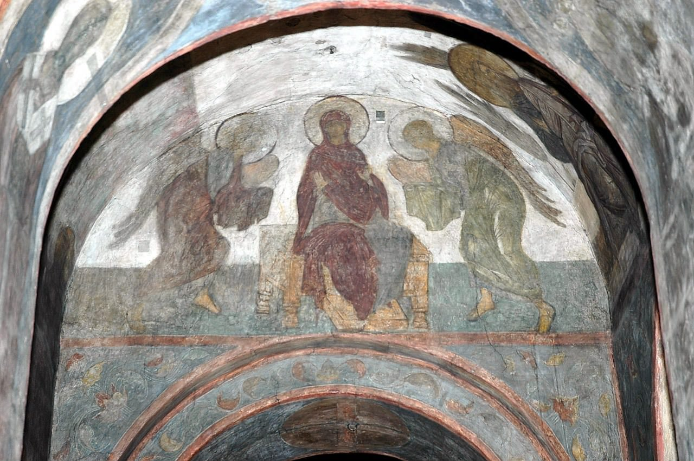

[🏠 Home](../../index.md)

# November 29

## 🧑‍🎨 Painting of the day

[Andrei Rublev](http://en.wikipedia.org/wiki/Andrei_Rublev) (Byzantine Art)

<button class="btn btn-success"
onclick=" window.open('https://lens.google.com/uploadbyurl?url=https://iretes.github.io/one-a-day/data/img/Andrei_Rublev_5.jpg','_blank')">
Search with Google Lens
</button>

## 🎼 Song of the day

> *Iron Man*
by Black Sabbath

 Written by Black Sabbath.

Released in Feb. , 1971.

<button class="btn btn-success"
onclick=" window.open('http://www.youtube.com/search?q=Iron Man by Black Sabbath','_blank')">
Search on YouTube
</button>

## 🏛️ UNESCO heritage site of the day

> *Archaeological Site of Sabratha*, Libya

A Phoenician trading-post that served as an outlet for the products of the African hinterland, Sabratha was part of the short-lived Numidian Kingdom of Massinissa before being Romanized and rebuilt in the 2nd and 3rd centuries A.D.

<button class="btn btn-success"
onclick=" window.open('http://www.google.com/search?q=Archaeological Site of Sabratha','_blank')">
Search on Google
</button>

## 🗺️ Place of the day

<iframe
src="https://www.mapcrunch.com"
name="mapcrunch"
width="500"
height="500"
allowTransparency="true"
scrolling="no"
frameborder="0"
>
</iframe>
## 🎨 Color of the day

> *[Phlox](https://en.wikipedia.org/wiki/Shades_of_purple#Psychedelic_purple_(phlox))*

&#9632;

## 🌿 Plant of the day

> *lace flower*

<button class="btn btn-success"
onclick=" window.open('http://www.google.com/search?q=lace flower','_blank')">
Search on Google
</button>

## 🧑‍🔬 Scientific discovery of the day

> *1828: Friedrich Wöhler synthesized urea, refuting vitalism.*

<button class="btn btn-success"
onclick=" window.open('http://www.google.com/search?q=1828: Friedrich Wöhler synthesized urea, refuting vitalism.','_blank')">
Search on Google
</button>

## 💭 Philosophical concept of the day

> *[Composition of Causes](https://en.wikipedia.org/wiki/Composition_of_Causes)*

## 🗣️ Saying of the day

> *Put your back up*

Make one angry.

## 🏳️‍🌈 International day

International Day of Solidarity with the Palestinian People.