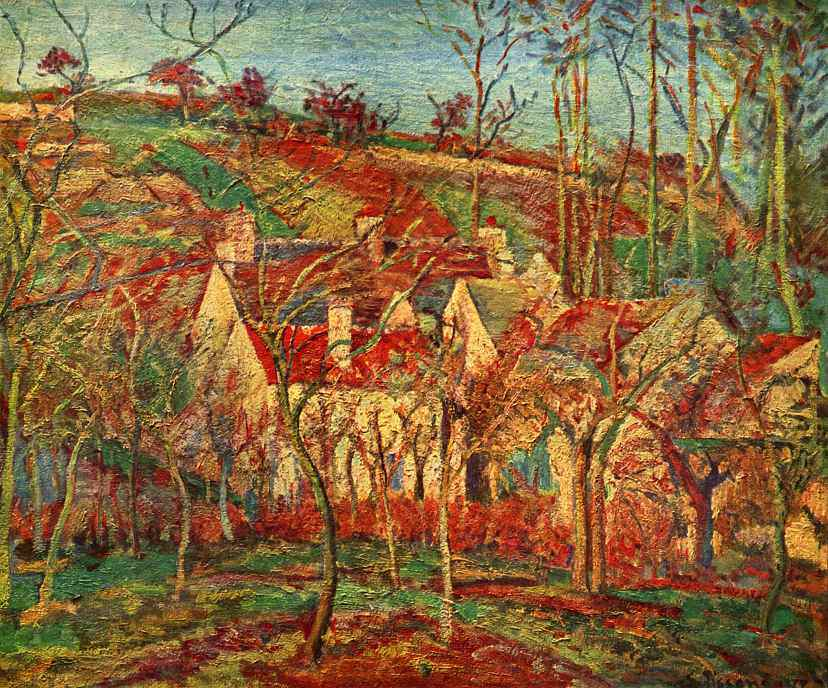

[🏠 Home](../../index.md)

# November 3

## 🧑‍🎨 Painting of the day

[Camille Pissarro](https://en.wikipedia.org/wiki/Camille_Pissarro) (Impressionism, Post-Impressionism)

<button class="btn btn-success"
onclick=" window.open('https://lens.google.com/uploadbyurl?url=https://iretes.github.io/one-a-day/data/img/Camille_Pissarro_2.jpg','_blank')">
Search with Google Lens
</button>

## 🎼 Song of the day

> *Wild Horses*
by The Rolling Stones

 Written by Mick Jagger, Keith Richards.

Released in April , 1971.

<button class="btn btn-success"
onclick=" window.open('http://www.youtube.com/search?q=Wild Horses by The Rolling Stones','_blank')">
Search on YouTube
</button>

## 🏛️ UNESCO heritage site of the day

> *Chartres Cathedral*, France

Partly built starting in 1145, and then reconstructed over a 26-year period after the fire of 1194, Chartres Cathedral marks the high point of French Gothic art. The vast nave, in pure ogival style, the porches adorned with fine sculptures from the middle of the 12th century, and the magnificent 12th- and 13th-century stained-glass windows, all in remarkable condition, combine to make it a masterpiece.

<button class="btn btn-success"
onclick=" window.open('http://www.google.com/search?q=Chartres Cathedral','_blank')">
Search on Google
</button>

## 🗺️ Place of the day

<iframe
src="https://www.mapcrunch.com"
name="mapcrunch"
width="500"
height="500"
allowTransparency="true"
scrolling="no"
frameborder="0"
>
</iframe>
## 🎨 Color of the day

> *[Spanish red](https://en.wikipedia.org/wiki/Shades_of_red#Spanish_red)*

&#9632;

## 🌿 Plant of the day

> *tickle weed*

<button class="btn btn-success"
onclick=" window.open('http://www.google.com/search?q=tickle weed','_blank')">
Search on Google
</button>

## 🧑‍🔬 Scientific discovery of the day

> *1934: Clive McCay: Calorie restriction extends the maximum lifespan of another species*

<button class="btn btn-success"
onclick=" window.open('http://www.google.com/search?q=1934: Clive McCay: Calorie restriction extends the maximum lifespan of another species','_blank')">
Search on Google
</button>

## 💭 Philosophical concept of the day

> *[Logic](https://en.wikipedia.org/wiki/Logic)*

## 🗣️ Saying of the day

> *At loggerheads*

In dispute with.
