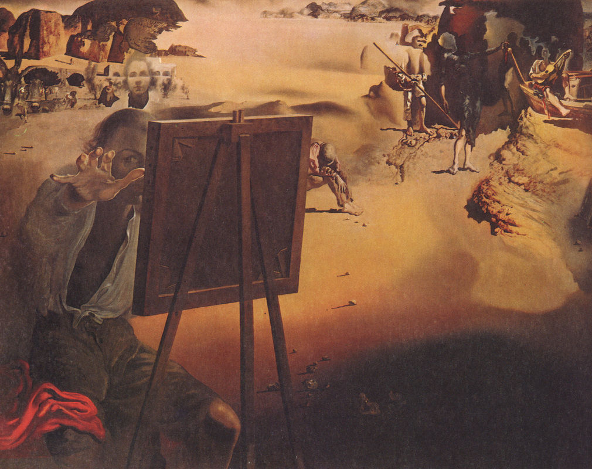

[🏠 Home](../../index.md)

# November 5

## 🧑‍🎨 Painting of the day

[Salvador Dali](http://en.wikipedia.org/wiki/Salvador_Dalí) (Surrealism)

<button class="btn btn-success"
onclick=" window.open('https://lens.google.com/uploadbyurl?url=https://iretes.github.io/one-a-day/data/img/Salvador_Dali_7.jpg','_blank')">
Search with Google Lens
</button>

## 🎼 Song of the day

> *Spirit in the Sky*
by Norman Greenbaum

 Written by Greenbaum.

Released in Feb. , 1970.

<button class="btn btn-success"
onclick=" window.open('http://www.youtube.com/search?q=Spirit in the Sky by Norman Greenbaum','_blank')">
Search on YouTube
</button>

## 🏛️ UNESCO heritage site of the day

> *Cologne Cathedral*, Germany

Begun in 1248, the construction of this Gothic masterpiece took place in several stages and was not completed until 1880. Over seven centuries, successive builders were inspired by the same faith and a spirit of absolute fidelity to the original plans. Apart from its exceptional intrinsic value and the artistic masterpieces it contains, Cologne Cathedral testifies to the enduring strength of European Christianity.

<button class="btn btn-success"
onclick=" window.open('http://www.google.com/search?q=Cologne Cathedral','_blank')">
Search on Google
</button>

## 🗺️ Place of the day

<iframe
src="https://www.mapcrunch.com"
name="mapcrunch"
width="500"
height="500"
allowTransparency="true"
scrolling="no"
frameborder="0"
>
</iframe>
## 🎨 Color of the day

> *[Dark sienna](https://en.wikipedia.org/wiki/Sienna)*

&#9632;

## 🌿 Plant of the day

> *christmas fern*

<button class="btn btn-success"
onclick=" window.open('http://www.google.com/search?q=christmas fern','_blank')">
Search on Google
</button>

## 🧑‍🔬 Scientific discovery of the day

> *3000 BC: The first deciphered numeral system is that of the Egyptian numerals, a sign-value system (as opposed to a place-value system).*

<button class="btn btn-success"
onclick=" window.open('http://www.google.com/search?q=3000 BC: The first deciphered numeral system is that of the Egyptian numerals, a sign-value system (as opposed to a place-value system).','_blank')"> 
Search on Google
</button>

## 💭 Philosophical concept of the day

> *[Kathekon](https://en.wikipedia.org/wiki/Kathekon)*

## 🗣️ Saying of the day

> *Vanish into thin air*

Disappear without trace.

## 🏳️‍🌈 International day

World Tsunami Awareness Day.