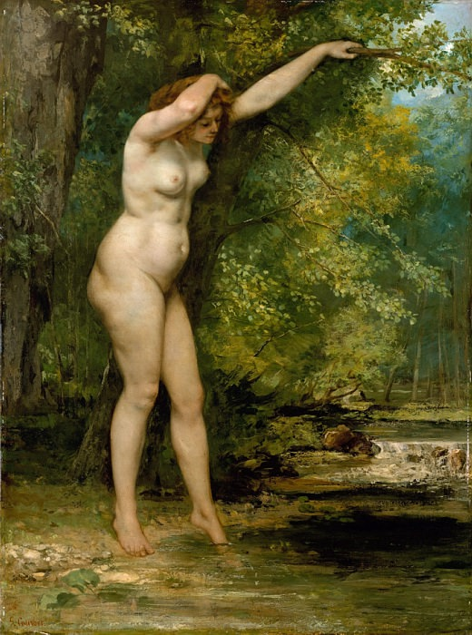

[🏠 Home](../../index.md)

# November 6

## 🧑‍🎨 Painting of the day

[Gustave Courbet](https://en.wikipedia.org/wiki/Gustave_Courbet) (Realism)

<button class="btn btn-success"
onclick=" window.open('https://lens.google.com/uploadbyurl?url=https://iretes.github.io/one-a-day/data/img/Gustave_Courbet_5.jpg','_blank')">
Search with Google Lens
</button>

## 🎼 Song of the day

> *Subterranean Homesick Blues*
by Bob Dylan

 Written by Dylan.

Released in March , 1965.

<button class="btn btn-success"
onclick=" window.open('http://www.youtube.com/search?q=Subterranean Homesick Blues by Bob Dylan','_blank')">
Search on YouTube
</button>

## 🏛️ UNESCO heritage site of the day

> *National Archeological Park of Tierradentro*, Colombia

Several monumental statues of human figures can be seen in the park, which also contains many hypogea dating from the 6th to the 10th century. These huge underground tombs (some burial chambers are up to 12 m wide) are decorated with motifs that reproduce the internal decor of homes of the period. They reveal the social complexity and cultural wealth of a pre-Hispanic society in the northern Andes.

<button class="btn btn-success"
onclick=" window.open('http://www.google.com/search?q=National Archeological Park of Tierradentro','_blank')">
Search on Google
</button>

## 🗺️ Place of the day

<iframe
src="https://www.mapcrunch.com"
name="mapcrunch"
width="500"
height="500"
allowTransparency="true"
scrolling="no"
frameborder="0"
>
</iframe>
## 🎨 Color of the day

> *[Warm black](https://en.wikipedia.org/wiki/Rich_black)*

&#9632;

## 🌿 Plant of the day

> *cutleaf maple*

<button class="btn btn-success"
onclick=" window.open('http://www.google.com/search?q=cutleaf maple','_blank')">
Search on Google
</button>

## 🧑‍🔬 Scientific discovery of the day

> *2024: On January 19, JAXA successfully landed the Smart Lander for Investigating Moon on the lunar surface, making Japan the 5th country to make a soft landing on the moon.*

<button class="btn btn-success"
onclick=" window.open('http://www.google.com/search?q=2024: On January 19, JAXA successfully landed the Smart Lander for Investigating Moon on the lunar surface, making Japan the 5th country to make a soft landing on the moon.','_blank')">
Search on Google
</button>

## 💭 Philosophical concept of the day

> *[Life imitating art](https://en.wikipedia.org/wiki/Life_imitating_art)*

## 🗣️ Saying of the day

> *Skin and blister*

Sister.

## 🏳️‍🌈 International day

International Day for Preventing the Exploitation of the Environment in War and Armed Conflict.