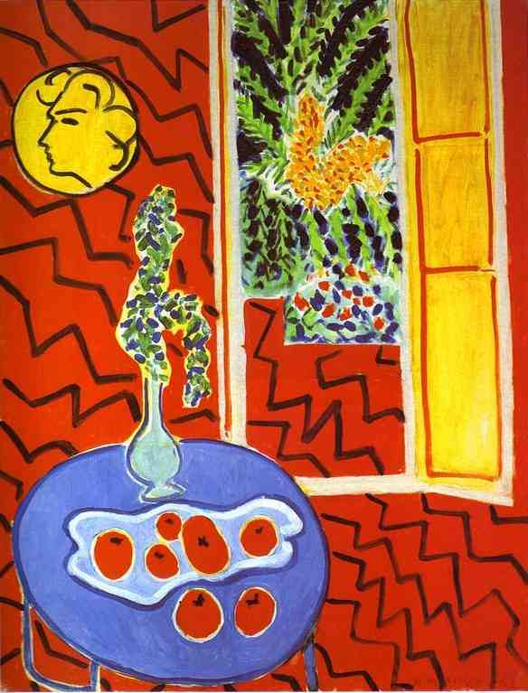

[🏠 Home](../../index.md)

# November 7

## 🧑‍🎨 Painting of the day

[Henri Matisse](http://en.wikipedia.org/wiki/Henri_Matisse) (Impressionism, Post-Impressionism)

<button class="btn btn-success"
onclick=" window.open('https://lens.google.com/uploadbyurl?url=https://iretes.github.io/one-a-day/data/img/Henri_Matisse_5.jpg','_blank')">
Search with Google Lens
</button>

## 🎼 Song of the day

> *I Cant Make You Love Me*
by Bonnie Raitt

 Written by Mike Reid, Allen Shamblin.

Released in Nov. , 1991.

<button class="btn btn-success"
onclick=" window.open('http://www.youtube.com/search?q=I Cant Make You Love Me by Bonnie Raitt','_blank')">
Search on YouTube
</button>

## 🏛️ UNESCO heritage site of the day

> *Archaeological Landscape of the First Coffee Plantations in the South-East of Cuba*, Cuba

The remains of the 19th-century coffee plantations in the foothills of the Sierra Maestra are unique evidence of a pioneer form of agriculture in a difficult terrain. They throw considerable light on the economic, social, and technological history of the Caribbean and Latin American region.

<button class="btn btn-success"
onclick=" window.open('http://www.google.com/search?q=Archaeological Landscape of the First Coffee Plantations in the South-East of Cuba','_blank')">
Search on Google
</button>

## 🗺️ Place of the day

<iframe
src="https://www.mapcrunch.com"
name="mapcrunch"
width="500"
height="500"
allowTransparency="true"
scrolling="no"
frameborder="0"
>
</iframe>
## 🎨 Color of the day

> *[Raspberry glacé](https://en.wikipedia.org/wiki/Raspberry_(color)#Raspberry_glacé)*

&#9632;

## 🌿 Plant of the day

> *dogwood*

<button class="btn btn-success"
onclick=" window.open('http://www.google.com/search?q=dogwood','_blank')">
Search on Google
</button>

## 🧑‍🔬 Scientific discovery of the day

> *1873: Willoughby Smith discovers photoconductivity.*

<button class="btn btn-success"
onclick=" window.open('http://www.google.com/search?q=1873: Willoughby Smith discovers photoconductivity.','_blank')">
Search on Google
</button>

## 💭 Philosophical concept of the day

> *[Aesthetic emotions](https://en.wikipedia.org/wiki/Aesthetic_emotions)*

## 🗣️ Saying of the day

> *Rise and shine*

Get out of bed and prepare for work.
