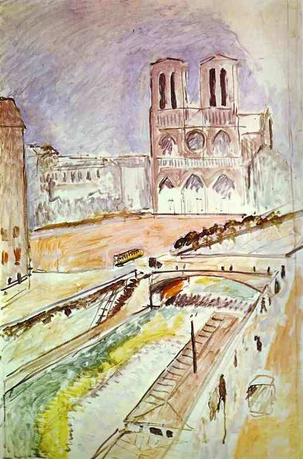

[🏠 Home](../../index.md)

# November 8

## 🧑‍🎨 Painting of the day

[Henri Matisse](http://en.wikipedia.org/wiki/Henri_Matisse) (Impressionism, Post-Impressionism)

<button class="btn btn-success"
onclick=" window.open('https://lens.google.com/uploadbyurl?url=https://iretes.github.io/one-a-day/data/img/Henri_Matisse_4.jpg','_blank')">
Search with Google Lens
</button>

## 🎼 Song of the day

> *We Will Rock You*
by Queen

 Written by Brian May, Mike Stone.

Released in Oct. , 1977.

<button class="btn btn-success"
onclick=" window.open('http://www.youtube.com/search?q=We Will Rock You by Queen','_blank')">
Search on YouTube
</button>

## 🏛️ UNESCO heritage site of the day

> *Petra*, Jordan

Inhabited since prehistoric times, this Nabataean caravan-city, situated between the Red Sea and the Dead Sea, was an important crossroads between Arabia, Egypt and Syria-Phoenicia. Petra is half-built, half-carved into the rock, and is surrounded by mountains riddled with passages and gorges. It is one of the world's most famous archaeological sites, where ancient Eastern traditions blend with Hellenistic architecture.

<button class="btn btn-success"
onclick=" window.open('http://www.google.com/search?q=Petra','_blank')">
Search on Google
</button>

## 🗺️ Place of the day

<iframe
src="https://www.mapcrunch.com"
name="mapcrunch"
width="500"
height="500"
allowTransparency="true"
scrolling="no"
frameborder="0"
>
</iframe>
## 🎨 Color of the day

> *[Lava](https://en.wikipedia.org/wiki/Lava_(color))*

&#9632;

## 🌿 Plant of the day

> *coffee plant*

<button class="btn btn-success"
onclick=" window.open('http://www.google.com/search?q=coffee plant','_blank')">
Search on Google
</button>

## 🧑‍🔬 Scientific discovery of the day

> *1898: Martinus Beijerinck: concluded that a virus is infectious—replicating in the host—and thus not a mere toxin, and gave it the name "virus"*

<button class="btn btn-success"
onclick=" window.open('http://www.google.com/search?q=1898: Martinus Beijerinck: concluded that a virus is infectious—replicating in the host—and thus not a mere toxin, and gave it the name "virus"','_blank')">
Search on Google
</button>

## 💭 Philosophical concept of the day

> *[Documentality](https://en.wikipedia.org/wiki/Documentality)*

## 🗣️ Saying of the day

> *Mend fences*

Re-establish good relations with people one has disagreed with. 
