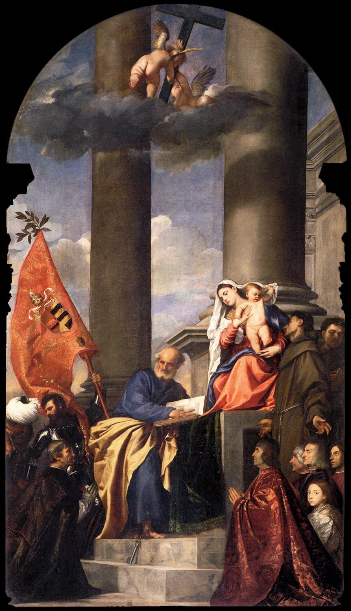

[🏠 Home](../../index.md)

# November 9

## 🧑‍🎨 Painting of the day

[Titian](http://en.wikipedia.org/wiki/Titian) (High Renaissance, Mannerism)

<button class="btn btn-success"
onclick=" window.open('https://lens.google.com/uploadbyurl?url=https://iretes.github.io/one-a-day/data/img/Titian_6.jpg','_blank')">
Search with Google Lens
</button>

## 🎼 Song of the day

> *Wind and Fire*
by Earth

 Written by Maurice White, Verdine White, Charles Stepney.

Released in March , 1975.

<button class="btn btn-success"
onclick=" window.open('http://www.youtube.com/search?q=Wind and Fire by Earth','_blank')">
Search on YouTube
</button>

## 🏛️ UNESCO heritage site of the day

> *Anjar*, Lebanon

The city of Anjar was founded by Caliph Walid I at the beginning of the 8th century. The ruins reveal a very regular layout, reminiscent of the palace-cities of ancient times, and are a unique testimony to city planning under the Umayyads.

<button class="btn btn-success"
onclick=" window.open('http://www.google.com/search?q=Anjar','_blank')">
Search on Google
</button>

## 🗺️ Place of the day

<iframe
src="https://www.mapcrunch.com"
name="mapcrunch"
width="500"
height="500"
allowTransparency="true"
scrolling="no"
frameborder="0"
>
</iframe>
## 🎨 Color of the day

> *[Mona Lisa](https://en.wikipedia.org/wiki/Shades_of_pink#Mona_Lisa)*

&#9632;

## 🌿 Plant of the day

> *plantain*

<button class="btn btn-success"
onclick=" window.open('http://www.google.com/search?q=plantain','_blank')">
Search on Google
</button>

## 🧑‍🔬 Scientific discovery of the day

> *14th century: French priest Jean Buridan provides a basic explanation of the price system.*

<button class="btn btn-success"
onclick=" window.open('http://www.google.com/search?q=14th century: French priest Jean Buridan provides a basic explanation of the price system.','_blank')"> 
Search on Google
</button>

## 💭 Philosophical concept of the day

> *[Prakriti](https://en.wikipedia.org/wiki/Prakriti)*

## 🗣️ Saying of the day

> *Up the ante*

To raise the stakes, either in betting or in any form of conflict or competition.

## 🏳️‍🌈 International day

International Week of Science and Peace (9-15 November).