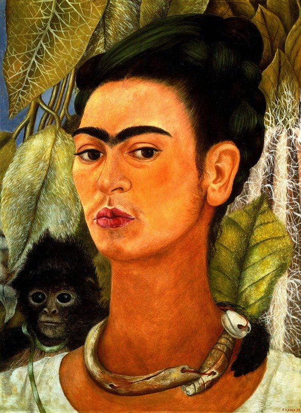

[🏠 Home](../../index.md)

# October 1

## 🧑‍🎨 Painting of the day

[Frida Kahlo](http://en.wikipedia.org/wiki/Frida_Kahlo) (Primitivism, Surrealism)

<button class="btn btn-success"
onclick=" window.open('https://lens.google.com/uploadbyurl?url=https://iretes.github.io/one-a-day/data/img/Frida_Kahlo_5.jpg','_blank')">
Search with Google Lens
</button>

## 🎼 Song of the day

> *Sloop John B*
by The Beach Boys

 Written by Traditional, Brian Wilson.

Released in March , 1966.

<button class="btn btn-success"
onclick=" window.open('http://www.youtube.com/search?q=Sloop John B by The Beach Boys','_blank')">
Search on YouTube
</button>

## 🏛️ UNESCO heritage site of the day

> *Hill Forts of Rajasthan*, India

The serial site, situated in the state of Rajastahan, includes six majestic forts in Chittorgarh; Kumbhalgarh; Sawai Madhopur; Jhalawar; Jaipur, and Jaisalmer. The ecclectic architecture of the forts, some up to 20 kilometres in circumference, bears testimony to the power of the Rajput princely states that flourished in the region from the 8th to the 18th centuries. Enclosed within defensive walls are major urban centres, palaces, trading centres and other buildings including temples that often predate the fortifications within which developed an elaborate courtly culture that supported learning, music and the arts. Some of the urban centres enclosed in the fortifications have survived, as have many of the site's temples and other sacred buildings. The forts use the natural defenses offered by the landscape: hills, deserts, rivers, and dense forests. They also feature extensive water harvesting structures, largely still in use today.

<button class="btn btn-success"
onclick=" window.open('http://www.google.com/search?q=Hill Forts of Rajasthan','_blank')">
Search on Google
</button>

## 🗺️ Place of the day

<iframe
src="https://www.mapcrunch.com"
name="mapcrunch"
width="500"
height="500"
allowTransparency="true"
scrolling="no"
frameborder="0"
>
</iframe>
## 🎨 Color of the day

> *[Italian sky blue](https://en.wikipedia.org/wiki/Sky_blue#Celeste)*

&#9632;

## 🌿 Plant of the day

> *thyme*

<button class="btn btn-success"
onclick=" window.open('http://www.google.com/search?q=thyme','_blank')">
Search on Google
</button>

## 🧑‍🔬 Scientific discovery of the day

> *1800 BC - 1600 BC: A Babylonian tablet uses 25⁄8 = 3.125 as an approximation for π, which has an error of 0.5%.*

<button class="btn btn-success"
onclick=" window.open('http://www.google.com/search?q=1800 BC - 1600 BC: A Babylonian tablet uses 25⁄8 = 3.125 as an approximation for π, which has an error of 0.5%.','_blank')"> 
Search on Google
</button>

## 💭 Philosophical concept of the day

> *[Trailokya (Triloka)](https://en.wikipedia.org/wiki/Trailokya)*

## 🗣️ Saying of the day

> *You get on my wick*

To get on someone's wick is to annoy them; get on their nerves. 

## 🏳️‍🌈 International day

International Day of Older Persons.