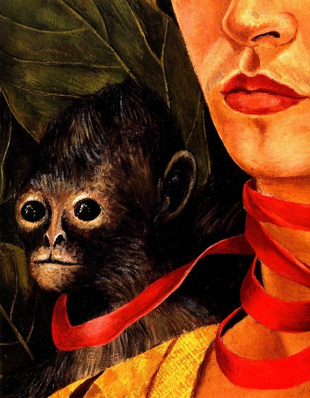

[🏠 Home](../../index.md)

# October 11

## 🧑‍🎨 Painting of the day

[Frida Kahlo](http://en.wikipedia.org/wiki/Frida_Kahlo) (Primitivism, Surrealism)

<button class="btn btn-success"
onclick=" window.open('https://lens.google.com/uploadbyurl?url=https://iretes.github.io/one-a-day/data/img/Frida_Kahlo_1.jpg','_blank')">
Search with Google Lens
</button>

## 🎼 Song of the day

> *Ooo Baby Baby*
by Smokey Robinson and The Miracles

 Written by Robinson, Warren Moore.

Released in March , 1965.

<button class="btn btn-success"
onclick=" window.open('http://www.youtube.com/search?q=Ooo Baby Baby by Smokey Robinson and The Miracles','_blank')">
Search on YouTube
</button>

## 🏛️ UNESCO heritage site of the day

> *Cilento and Vallo di Diano National Park with the Archeological Sites of Paestum and Velia, and the Certosa di Padula*, Italy

The Cilento is an outstanding cultural landscape. The dramatic groups of sanctuaries and settlements along its three east–west mountain ridges vividly portray the area's historical evolution: it was a major route not only for trade, but also for cultural and political interaction during the prehistoric and medieval periods. The Cilento was also the boundary between the Greek colonies of Magna Graecia and the indigenous Etruscan and Lucanian peoples. The remains of two major cities from classical times, Paestum and Velia, are found there.

<button class="btn btn-success"
onclick=" window.open('http://www.google.com/search?q=Cilento and Vallo di Diano National Park with the Archeological Sites of Paestum and Velia, and the Certosa di Padula','_blank')">
Search on Google
</button>

## 🗺️ Place of the day

<iframe
src="https://www.mapcrunch.com"
name="mapcrunch"
width="500"
height="500"
allowTransparency="true"
scrolling="no"
frameborder="0"
>
</iframe>
## 🎨 Color of the day

> *[Lemon yellow (Crayola)](https://en.wikipedia.org/wiki/Lemon_(color)#Lemon_yellow_(Crayola))*

&#9632;

## 🌿 Plant of the day

> *itch weed*

<button class="btn btn-success"
onclick=" window.open('http://www.google.com/search?q=itch weed','_blank')">
Search on Google
</button>

## 🧑‍🔬 Scientific discovery of the day

> *1931: Kurt Gödel: incompleteness theorems prove formal axiomatic systems are incomplete*

<button class="btn btn-success"
onclick=" window.open('http://www.google.com/search?q=1931: Kurt Gödel: incompleteness theorems prove formal axiomatic systems are incomplete','_blank')">
Search on Google
</button>

## 💭 Philosophical concept of the day

> *[Mind](https://en.wikipedia.org/wiki/Mind)*

## 🗣️ Saying of the day

> *That's all folks!*

The catchphrase on the
banner shown at the end of Looney Tunes cartoons.

## 🏳️‍🌈 International day

International Day of the Girl Child.