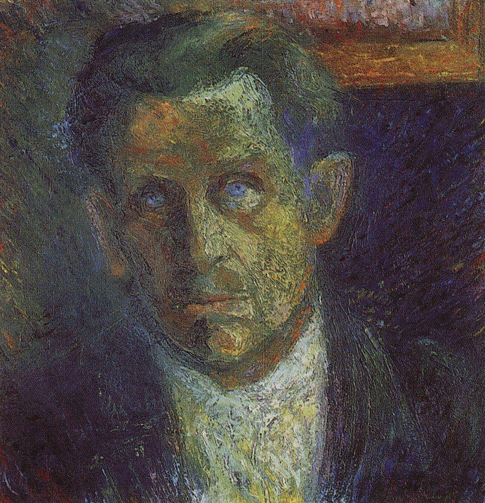

[🏠 Home](../../index.md)

# October 12

## 🧑‍🎨 Painting of the day

[Kazimir Malevich](http://en.wikipedia.org/wiki/Kazimir_Malevich) (Suprematism)

<button class="btn btn-success"
onclick=" window.open('https://lens.google.com/uploadbyurl?url=https://iretes.github.io/one-a-day/data/img/Kazimir_Malevich_5.jpg','_blank')">
Search with Google Lens
</button>

## 🎼 Song of the day

> *Higher Ground*
by Stevie Wonder

 Written by Wonder.

Released in Aug. , 1973.

<button class="btn btn-success"
onclick=" window.open('http://www.youtube.com/search?q=Higher Ground by Stevie Wonder','_blank')">
Search on YouTube
</button>

## 🏛️ UNESCO heritage site of the day

> *Kairouan*, Tunisia

Founded in 670, Kairouan flourished under the Aghlabid dynasty in the 9th century. Despite the transfer of the political capital to Tunis in the 12th century, Kairouan remained the Maghreb's principal holy city. Its rich architectural heritage includes the Great Mosque, with its marble and porphyry columns, and the 9th-century Mosque of the Three Gates.

<button class="btn btn-success"
onclick=" window.open('http://www.google.com/search?q=Kairouan','_blank')">
Search on Google
</button>

## 🗺️ Place of the day

<iframe
src="https://www.mapcrunch.com"
name="mapcrunch"
width="500"
height="500"
allowTransparency="true"
scrolling="no"
frameborder="0"
>
</iframe>
## 🎨 Color of the day

> *[Mauve](https://en.wikipedia.org/wiki/Mauve)*

&#9632;

## 🌿 Plant of the day

> *hoary ragwort*

<button class="btn btn-success"
onclick=" window.open('http://www.google.com/search?q=hoary ragwort','_blank')">
Search on Google
</button>

## 🧑‍🔬 Scientific discovery of the day

> *3rd century: Diophantus uses a primitive form of algebraic symbolism, which is quickly forgotten.*

<button class="btn btn-success"
onclick=" window.open('http://www.google.com/search?q=3rd century: Diophantus uses a primitive form of algebraic symbolism, which is quickly forgotten.','_blank')"> 
Search on Google
</button>

## 💭 Philosophical concept of the day

> *[Infallibility](https://en.wikipedia.org/wiki/Infallibility)*

## 🗣️ Saying of the day

> *Preposterous*

Now chiefly used to mean absurd; ridiculous. 

## 🏳️‍🌈 International day

World Migratory Bird Day.