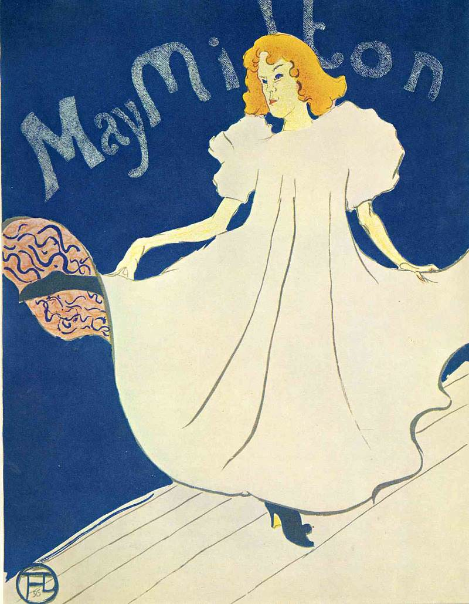

[🏠 Home](../../index.md)

# October 13

## 🧑‍🎨 Painting of the day

[Henri de Toulouse-Lautrec](https://en.wikipedia.org/wiki/Henri_de_Toulouse-Lautrec) (Post-Impressionism)

<button class="btn btn-success"
onclick=" window.open('https://lens.google.com/uploadbyurl?url=https://iretes.github.io/one-a-day/data/img/Henri_de_Toulouse-Lautrec_6.jpg','_blank')">
Search with Google Lens
</button>

## 🎼 Song of the day

> *Hallelujah*
by Jeff Buckley

 Written by Leonard Cohen.

Released in Aug. , 1994.

<button class="btn btn-success"
onclick=" window.open('http://www.youtube.com/search?q=Hallelujah by Jeff Buckley','_blank')">
Search on YouTube
</button>

## 🏛️ UNESCO heritage site of the day

> *Cordouan Lighthouse*, France

The Lighthouse of Cordouan rises up on a shallow rocky plateau in the Atlantic Ocean at the mouth of the Gironde estuary, in a highly exposed and hostile environment. Built in white limestone dressed blocks at the turn of the 16th and 17th centuries, it was designed by engineer Louis de Foix and remodelled by engineer Joseph Teulère in the late 18th century. A masterpiece of maritime signalling, Cordouan’s monumental tower is decorated with pilasters, columns modillions and gargoyles. It embodies the great stages of the architectural and technological history of lighthouses and was built with the ambition of continuing the tradition of famous beacons of antiquity, illustrating the art of building lighthouses in a period of renewed navigation, when beacons played an important role as territorial markers and as instruments of safety. Finally, the increase of its height, in the late 18th century, and the changes to its light chamber, attest to the progress of science and technology of the period. Its architectural forms drew inspiration from ancient models, Renaissance Mannerism and the specific architectural language of France’s engineering school <em>École des Ponts et Chaussées</em>.

<button class="btn btn-success"
onclick=" window.open('http://www.google.com/search?q=Cordouan Lighthouse','_blank')">
Search on Google
</button>

## 🗺️ Place of the day

<iframe
src="https://www.mapcrunch.com"
name="mapcrunch"
width="500"
height="500"
allowTransparency="true"
scrolling="no"
frameborder="0"
>
</iframe>
## 🎨 Color of the day

> *[Dodger blue](https://en.wikipedia.org/wiki/Dodger_blue)*

&#9632;

## 🌿 Plant of the day

> *virginia winterberry*

<button class="btn btn-success"
onclick=" window.open('http://www.google.com/search?q=virginia winterberry','_blank')">
Search on Google
</button>

## 🧑‍🔬 Scientific discovery of the day

> *1964: Murray Gell-Mann and George Zweig: postulates quarks, leading to the standard model*

<button class="btn btn-success"
onclick=" window.open('http://www.google.com/search?q=1964: Murray Gell-Mann and George Zweig: postulates quarks, leading to the standard model','_blank')">
Search on Google
</button>

## 💭 Philosophical concept of the day

> *[Moral responsibility](https://en.wikipedia.org/wiki/Moral_responsibility)*

## 🗣️ Saying of the day

> *The love that dare not speak its name*

A reference to homosexual love, although Oscar Wilde
 denied this in his defense of the charge of gross indecency.

## 🏳️‍🌈 International day

International Day for Disaster Risk Reduction.