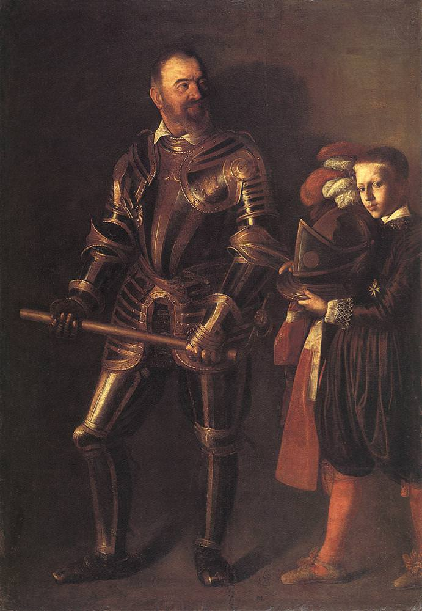

[🏠 Home](../../index.md)

# October 14

## 🧑‍🎨 Painting of the day

[Caravaggio](http://en.wikipedia.org/wiki/Caravaggio) (Baroque)

<button class="btn btn-success"
onclick=" window.open('https://lens.google.com/uploadbyurl?url=https://iretes.github.io/one-a-day/data/img/Caravaggio_1.jpg','_blank')">
Search with Google Lens
</button>

## 🎼 Song of the day

> *Oh*
by The Dells

 Written by Marvin Junior, John Funches.

Released in Aug. , 1969.

<button class="btn btn-success"
onclick=" window.open('http://www.youtube.com/search?q=Oh by The Dells','_blank')">
Search on YouTube
</button>

## 🏛️ UNESCO heritage site of the day

> *Roskilde Cathedral*, Denmark

Built in the 12th and 13th centuries, this was Scandinavia's first Gothic cathedral to be built of brick and it encouraged the spread of this style throughout northern Europe. It has been the mausoleum of the Danish royal family since the 15th century. Porches and side chapels were added up to the end of the 19th century. Thus it provides a clear overview of the development of European religious architecture.

<button class="btn btn-success"
onclick=" window.open('http://www.google.com/search?q=Roskilde Cathedral','_blank')">
Search on Google
</button>

## 🗺️ Place of the day

<iframe
src="https://www.mapcrunch.com"
name="mapcrunch"
width="500"
height="500"
allowTransparency="true"
scrolling="no"
frameborder="0"
>
</iframe>
## 🎨 Color of the day

> *[Razzle dazzle rose](https://en.wikipedia.org/wiki/Rose_(color)#Razzle_dazzle_rose)*

&#9632;

## 🌿 Plant of the day

> *hard thistle*

<button class="btn btn-success"
onclick=" window.open('http://www.google.com/search?q=hard thistle','_blank')">
Search on Google
</button>

## 🧑‍🔬 Scientific discovery of the day

> *1500: Scipione del Ferro solves the special cubic equation *

<button class="btn btn-success"
onclick=" window.open('http://www.google.com/search?q=1500: Scipione del Ferro solves the special cubic equation ','_blank')">
Search on Google
</button>

## 💭 Philosophical concept of the day

> *[Implicate and explicate order according to David Bohm](https://en.wikipedia.org/wiki/Implicate_and_explicate_order_according_to_David_Bohm)*

## 🗣️ Saying of the day

> *(The) pen is mightier than the sword *

Literal meaning.
