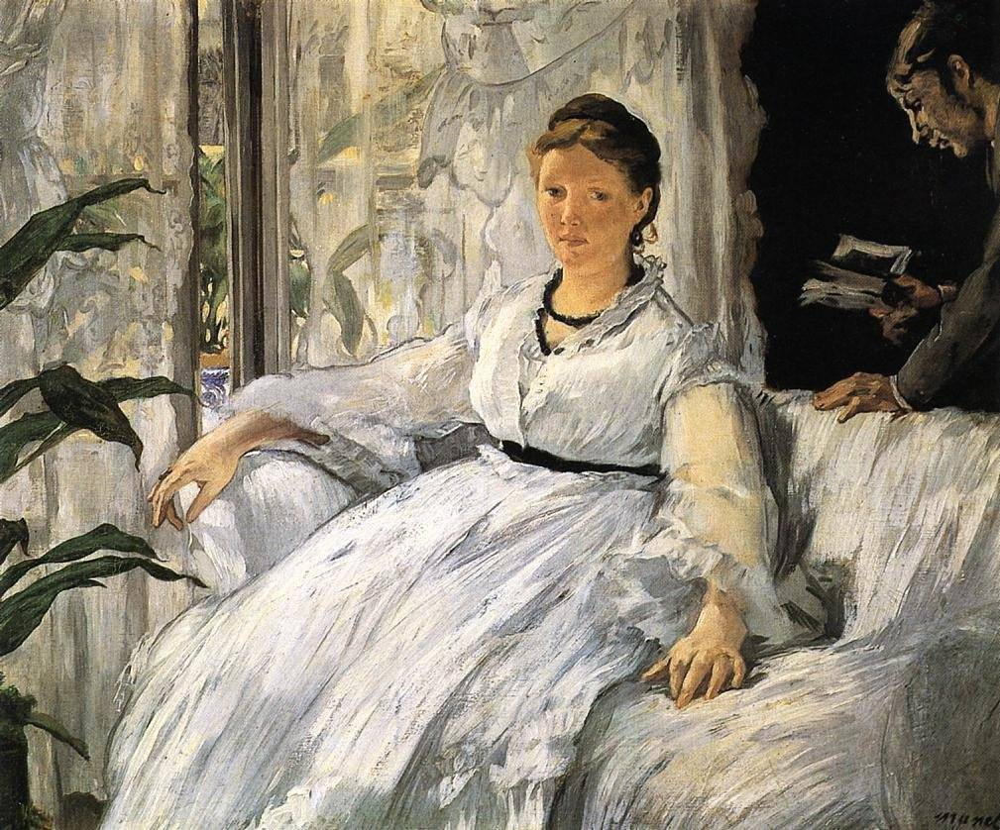

[🏠 Home](../../index.md)

# October 16

## 🧑‍🎨 Painting of the day

[Edouard Manet](http://en.wikipedia.org/wiki/Édouard_Manet) (Realism, Impressionism)

<button class="btn btn-success"
onclick=" window.open('https://lens.google.com/uploadbyurl?url=https://iretes.github.io/one-a-day/data/img/Edouard_Manet_1.jpg','_blank')">
Search with Google Lens
</button>

## 🎼 Song of the day

> *Wild Thing*
by The Troggs

 Written by Chip Taylor.

Released in June , 1966.

<button class="btn btn-success"
onclick=" window.open('http://www.youtube.com/search?q=Wild Thing by The Troggs','_blank')">
Search on YouTube
</button>

## 🏛️ UNESCO heritage site of the day

> *Palace and Park of Fontainebleau*, France

Used by the kings of France from the 12th century, the medieval royal hunting lodge of Fontainebleau, standing at the heart of a vast forest in the Ile-de-France, was transformed, enlarged and embellished in the 16th century by François I, who wanted to make a 'New Rome' of it. Surrounded by an immense park, the Italianate palace combines Renaissance and French artistic traditions.

<button class="btn btn-success"
onclick=" window.open('http://www.google.com/search?q=Palace and Park of Fontainebleau','_blank')">
Search on Google
</button>

## 🗺️ Place of the day

<iframe
src="https://www.mapcrunch.com"
name="mapcrunch"
width="500"
height="500"
allowTransparency="true"
scrolling="no"
frameborder="0"
>
</iframe>
## 🎨 Color of the day

> *[Charm pink](https://en.wikipedia.org/wiki/Shades_of_pink#Charm_pink)*

&#9632;

## 🌿 Plant of the day

> *gray alder*

<button class="btn btn-success"
onclick=" window.open('http://www.google.com/search?q=gray alder','_blank')">
Search on Google
</button>

## 🧑‍🔬 Scientific discovery of the day

> *3rd century BC: Eratosthenes discovers the Sieve of Eratosthenes.*

<button class="btn btn-success"
onclick=" window.open('http://www.google.com/search?q=3rd century BC: Eratosthenes discovers the Sieve of Eratosthenes.','_blank')">
Search on Google
</button>

## 💭 Philosophical concept of the day

> *[Fidelity](https://en.wikipedia.org/wiki/Fidelity)*

## 🗣️ Saying of the day

> *In the cart*

In trouble.

## 🏳️‍🌈 International day

World Food Day.