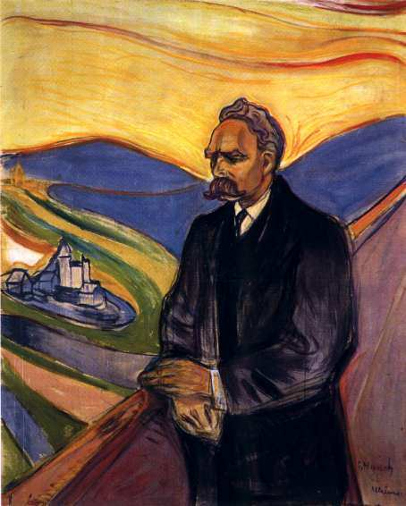

[🏠 Home](../../index.md)

# October 17

## 🧑‍🎨 Painting of the day

[Edvard Munch](https://en.wikipedia.org/wiki/Edvard_Munch) (Symbolism, Expressionism)

<button class="btn btn-success"
onclick=" window.open('https://lens.google.com/uploadbyurl?url=https://iretes.github.io/one-a-day/data/img/Edvard_Munch_8.jpg','_blank')">
Search with Google Lens
</button>

## 🎼 Song of the day

> *Mississippi*
by Bob Dylan

 Written by Dylan.

Released in Sept. , 2001.

<button class="btn btn-success"
onclick=" window.open('http://www.youtube.com/search?q=Mississippi by Bob Dylan','_blank')">
Search on YouTube
</button>

## 🏛️ UNESCO heritage site of the day

> *Frontiers of the Roman Empire – The Danube Limes (Western Segment)*, Austria,Germany,Slovakia

It covers almost 600km of the whole Roman Empire’s Danube frontier. The property formed part of the much large frontier of the Roman Empire that encircled the Mediterranean Sea. The Danube Limes (Western Segment) reflects the specificities of this part of the Roman Frontier through the selection of sites that represent key elements from road, legionary fortresses and their associated settlements to small forts and temporary camps, and the way these structures relate to local topography. 

<button class="btn btn-success"
onclick=" window.open('http://www.google.com/search?q=Frontiers of the Roman Empire – The Danube Limes (Western Segment)','_blank')">
Search on Google
</button>

## 🗺️ Place of the day

<iframe
src="https://www.mapcrunch.com"
name="mapcrunch"
width="500"
height="500"
allowTransparency="true"
scrolling="no"
frameborder="0"
>
</iframe>
## 🎨 Color of the day

> *[Banana Mania](https://en.wikipedia.org/wiki/List_of_Crayola_crayon_colors#Standard_colors)*

&#9632;

## 🌿 Plant of the day

> *fellenwort*

<button class="btn btn-success"
onclick=" window.open('http://www.google.com/search?q=fellenwort','_blank')">
Search on Google
</button>

## 🧑‍🔬 Scientific discovery of the day

> *16th century: François Viète discovers Vieta's formulas.*

<button class="btn btn-success"
onclick=" window.open('http://www.google.com/search?q=16th century: François Viète discovers Vieta s formulas.','_blank')"> 
Search on Google
</button>

## 💭 Philosophical concept of the day

> *[Cultural hegemony](https://en.wikipedia.org/wiki/Cultural_hegemony)*

## 🗣️ Saying of the day

> *Handbags at ten paces*

'Handbags at ten paces', sometimes shortened just to 'handbags', is a comic reference to a confrontation which is histrionic but which doesn't involve physical violence. Such confrontations are also called handbag situations. 

## 🏳️‍🌈 International day

International Day for the Eradication of Poverty.