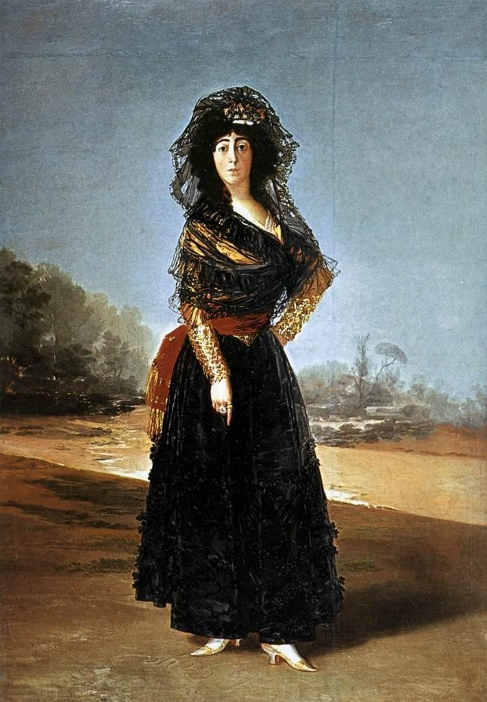

[🏠 Home](../../index.md)

# October 19

## 🧑‍🎨 Painting of the day

[Francisco Goya](http://en.wikipedia.org/wiki/Francisco_Goya) (Romanticism)

<button class="btn btn-success"
onclick=" window.open('https://lens.google.com/uploadbyurl?url=https://iretes.github.io/one-a-day/data/img/Francisco_Goya_2.jpg','_blank')">
Search with Google Lens
</button>

## 🎼 Song of the day

> *Highway to Hell*
by AC/DC

 Written by Angus Young, Malcolm Young, Bon Scott.

Released in Aug. , 1979.

<button class="btn btn-success"
onclick=" window.open('http://www.youtube.com/search?q=Highway to Hell by AC/DC','_blank')">
Search on YouTube
</button>

## 🏛️ UNESCO heritage site of the day

> *Pergamon and its Multi-Layered Cultural Landscape*, Turkey

This site rises high above the Bakirçay Plain in Turkey’s Aegean region. The acropolis of Pergamon was the capital of the Hellenistic Attalid dynasty, a major centre of learning in the ancient world. Monumental temples, theatres, stoa or porticoes, gymnasium, altar and library were set into the sloping terrain surrounded by an extensive city wall. The rock-cut Kybele Sanctuary lies to the north-west on another hill visually linked to the acropolis. Later the city became capital of the Roman province of Asia known for its Asclepieion healing centre. The acropolis crowns a landscape containing burial mounds and remains of the Roman, Byzantine and Ottoman empires in and around the modern town of Bergama on the lower slopes.

<button class="btn btn-success"
onclick=" window.open('http://www.google.com/search?q=Pergamon and its Multi-Layered Cultural Landscape','_blank')">
Search on Google
</button>

## 🗺️ Place of the day

<iframe
src="https://www.mapcrunch.com"
name="mapcrunch"
width="500"
height="500"
allowTransparency="true"
scrolling="no"
frameborder="0"
>
</iframe>
## 🎨 Color of the day

> *[Orange-yellow (Crayola)](https://en.wikipedia.org/wiki/Marigold_(color)#Orange-yellow_(Crayola))*

&#9632;

## 🌿 Plant of the day

> *shadbush*

<button class="btn btn-success"
onclick=" window.open('http://www.google.com/search?q=shadbush','_blank')">
Search on Google
</button>

## 🧑‍🔬 Scientific discovery of the day

> *1827: Georg Ohm: Ohm's law (Electricity).*

<button class="btn btn-success"
onclick=" window.open('http://www.google.com/search?q=1827: Georg Ohm: Ohm s law (Electricity).','_blank')">
Search on Google
</button>

## 💭 Philosophical concept of the day

> *[Integral philosophy](https://en.wikipedia.org/wiki/Integral_philosophy)*

## 🗣️ Saying of the day

> *Cloud nine*

To be 'on cloud nine' is to be in a state of blissful happiness.
