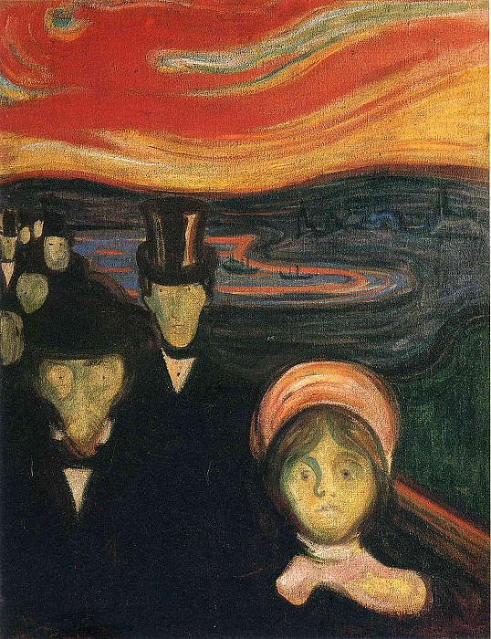

[🏠 Home](../../index.md)

# October 20

## 🧑‍🎨 Painting of the day

[Edvard Munch](https://en.wikipedia.org/wiki/Edvard_Munch) (Symbolism, Expressionism)

<button class="btn btn-success"
onclick=" window.open('https://lens.google.com/uploadbyurl?url=https://iretes.github.io/one-a-day/data/img/Edvard_Munch_3.jpg','_blank')">
Search with Google Lens
</button>

## 🎼 Song of the day

> *Paranoid Android*
by Radiohead

 Written by Thom Yorke.

Released in May , 1997.

<button class="btn btn-success"
onclick=" window.open('http://www.youtube.com/search?q=Paranoid Android by Radiohead','_blank')">
Search on YouTube
</button>

## 🏛️ UNESCO heritage site of the day

> *Heart of Neolithic Orkney*, United Kingdom of Great Britain and Northern Ireland

The group of Neolithic monuments on Orkney consists of a large chambered tomb (Maes Howe), two ceremonial stone circles (the Stones of Stenness and the Ring of Brodgar) and a settlement (Skara Brae), together with a number of unexcavated burial, ceremonial and settlement sites. The group constitutes a major prehistoric cultural landscape which gives a graphic depiction of life in this remote archipelago in the far north of Scotland some 5,000 years ago.

<button class="btn btn-success"
onclick=" window.open('http://www.google.com/search?q=Heart of Neolithic Orkney','_blank')">
Search on Google
</button>

## 🗺️ Place of the day

<iframe
src="https://www.mapcrunch.com"
name="mapcrunch"
width="500"
height="500"
allowTransparency="true"
scrolling="no"
frameborder="0"
>
</iframe>
## 🎨 Color of the day

> *[Neon green](https://en.wikipedia.org/wiki/Shades_of_green#Neon_green)*

&#9632;

## 🌿 Plant of the day

> *summer lilac*

<button class="btn btn-success"
onclick=" window.open('http://www.google.com/search?q=summer lilac','_blank')">
Search on Google
</button>

## 🧑‍🔬 Scientific discovery of the day

> *1912: Alfred Wegener: Continental drift*

<button class="btn btn-success"
onclick=" window.open('http://www.google.com/search?q=1912: Alfred Wegener: Continental drift','_blank')"> 
Search on Google
</button>

## 💭 Philosophical concept of the day

> *[Common sense](https://en.wikipedia.org/wiki/Common_sense)*

## 🗣️ Saying of the day

> *A priori*

From the previous. 
