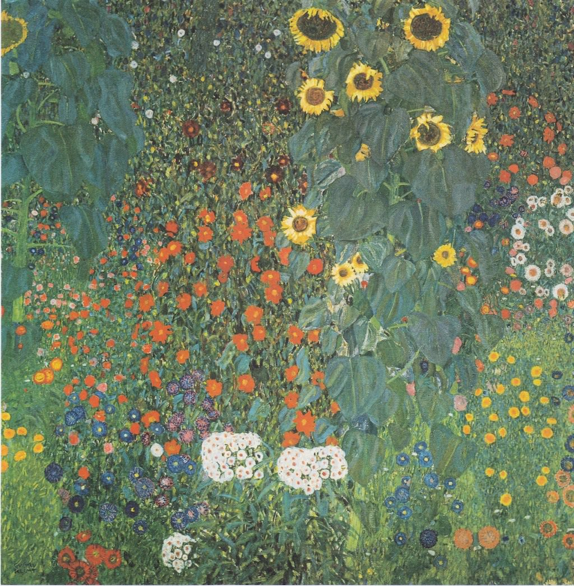

[🏠 Home](../../index.md)

# October 22

## 🧑‍🎨 Painting of the day

[Gustav Klimt](http://en.wikipedia.org/wiki/Gustav_Klimt) (Symbolism, Art Nouveau)

<button class="btn btn-success"
onclick=" window.open('https://lens.google.com/uploadbyurl?url=https://iretes.github.io/one-a-day/data/img/Gustav_Klimt_5.jpg','_blank')">
Search with Google Lens
</button>

## 🎼 Song of the day

> *Mack the Knife*
by Bobby Darin

 Written by Marc Blitzstein, Bertolt Brecht, Kurt Weill.

Released in March , 1959.

<button class="btn btn-success"
onclick=" window.open('http://www.youtube.com/search?q=Mack the Knife by Bobby Darin','_blank')">
Search on YouTube
</button>

## 🏛️ UNESCO heritage site of the day

> *Ancient City of Polonnaruwa*, Sri Lanka

Polonnaruwa was the second capital of Sri Lanka after the destruction of Anuradhapura in 993. It comprises, besides the Brahmanic monuments built by the Cholas, the monumental ruins of the fabulous garden-city created by Parakramabahu I in the 12th century.

<button class="btn btn-success"
onclick=" window.open('http://www.google.com/search?q=Ancient City of Polonnaruwa','_blank')">
Search on Google
</button>

## 🗺️ Place of the day

<iframe
src="https://www.mapcrunch.com"
name="mapcrunch"
width="500"
height="500"
allowTransparency="true"
scrolling="no"
frameborder="0"
>
</iframe>
## 🎨 Color of the day

> *[Dark orchid](https://en.wikipedia.org/wiki/Orchid_(color)#Dark_orchid)*

&#9632;

## 🌿 Plant of the day

> *red brush*

<button class="btn btn-success"
onclick=" window.open('http://www.google.com/search?q=red brush','_blank')">
Search on Google
</button>

## 🧑‍🔬 Scientific discovery of the day

> *By 499: Aryabhata's work shows the use of the modern fraction notation, known as bhinnarasi.*

<button class="btn btn-success"
onclick=" window.open('http://www.google.com/search?q=By 499: Aryabhata s work shows the use of the modern fraction notation, known as bhinnarasi.','_blank')"> 
Search on Google
</button>

## 💭 Philosophical concept of the day

> *[Loyalty](https://en.wikipedia.org/wiki/Loyalty)*

## 🗣️ Saying of the day

> *Like a chicken with its head cut off*

In a frenzied manner.
