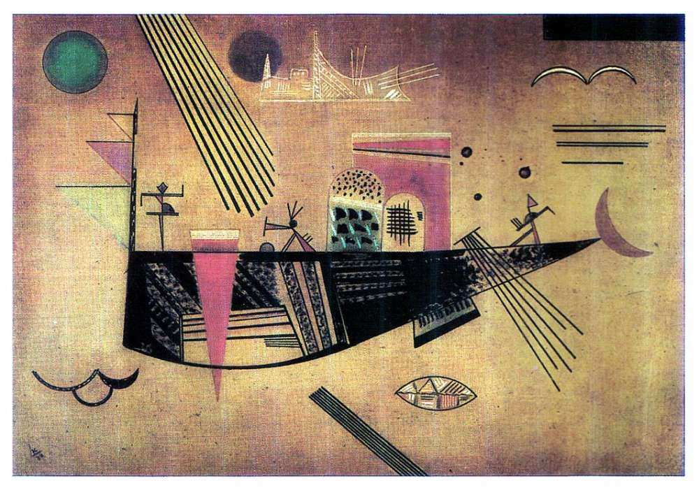

[🏠 Home](../../index.md)

# October 23

## 🧑‍🎨 Painting of the day

[Vasiliy Kandinskiy](http://en.wikipedia.org/wiki/Wassily_Kandinsky) (Expressionism, Abstractionism)

<button class="btn btn-success"
onclick=" window.open('https://lens.google.com/uploadbyurl?url=https://iretes.github.io/one-a-day/data/img/Vasiliy_Kandinskiy_8.jpg','_blank')">
Search with Google Lens
</button>

## 🎼 Song of the day

> *Money Honey*
by The Drifters

 Written by Jesse Stone.

Released in Sept., 1953.

<button class="btn btn-success"
onclick=" window.open('http://www.youtube.com/search?q=Money Honey by The Drifters','_blank')">
Search on YouTube
</button>

## 🏛️ UNESCO heritage site of the day

> *Historic Inner City of Paramaribo*, Suriname

Paramaribo is a former Dutch colonial town from the 17th and 18th centuries planted on the northern coast of tropical South America. The original and highly characteristic street plan of the historic centre remains intact. Its buildings illustrate the gradual fusion of Dutch architectural influence with traditional local techniques and materials.

<button class="btn btn-success"
onclick=" window.open('http://www.google.com/search?q=Historic Inner City of Paramaribo','_blank')">
Search on Google
</button>

## 🗺️ Place of the day

<iframe
src="https://www.mapcrunch.com"
name="mapcrunch"
width="500"
height="500"
allowTransparency="true"
scrolling="no"
frameborder="0"
>
</iframe>
## 🎨 Color of the day

> *[Deep saffron](https://en.wikipedia.org/wiki/Saffron_(color)#India_saffron_or_deep_saffron)*

&#9632;

## 🌿 Plant of the day

> *azolla*

<button class="btn btn-success"
onclick=" window.open('http://www.google.com/search?q=azolla','_blank')">
Search on Google
</button>

## 🧑‍🔬 Scientific discovery of the day

> *1970: James H. Ellis proposed the possibility of "non-secret encryption", more commonly termed public-key cryptography, a concept that would be implemented by his GCHQ colleague Clifford Cocks in 1973, in what would become known as the RSA algorithm, with key exchange added by a third colleague Malcolm J. Williamson, in 1975.*

<button class="btn btn-success"
onclick=" window.open('http://www.google.com/search?q=1970: James H. Ellis proposed the possibility of non-secret encryption, more commonly termed public-key cryptography, a concept that would be implemented by his GCHQ colleague Clifford Cocks in 1973, in what would become known as the RSA algorithm, with key exchange added by a third colleague Malcolm J. Williamson, in 1975.','_blank')"> 
Search on Google
</button>

## 💭 Philosophical concept of the day

> *[Existence](https://en.wikipedia.org/wiki/Existence)*

## 🗣️ Saying of the day

> *Hell or high water*

Any great difficulty or obstacle.
