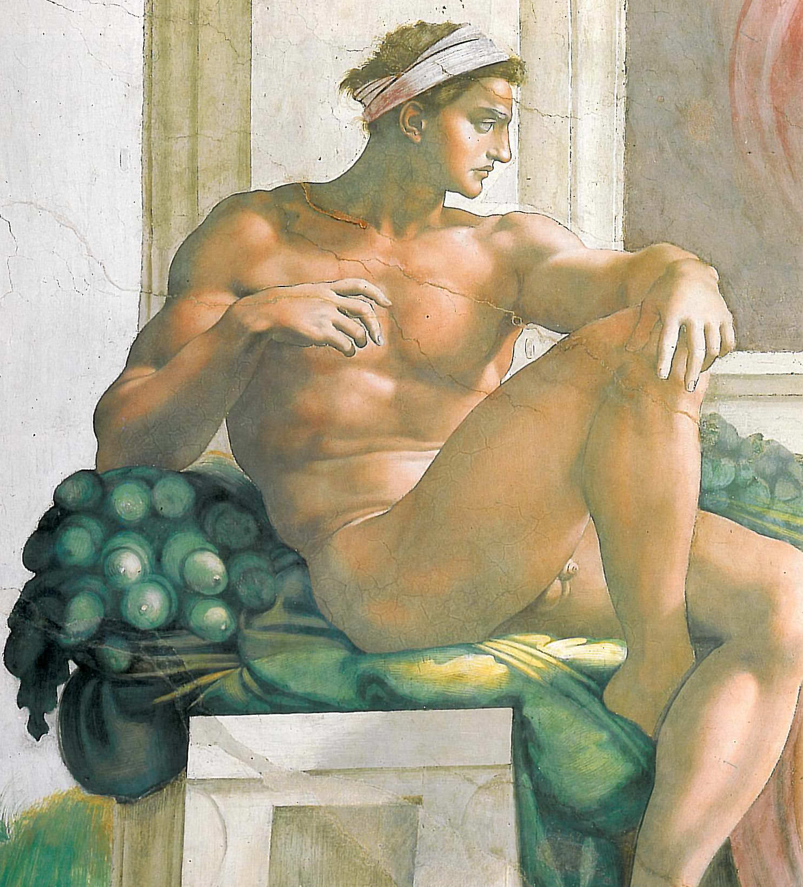

[🏠 Home](../../index.md)

# October 24

## 🧑‍🎨 Painting of the day

[Michelangelo](https://en.wikipedia.org/wiki/Michelangelo) (High Renaissance)

<button class="btn btn-success"
onclick=" window.open('https://lens.google.com/uploadbyurl?url=https://iretes.github.io/one-a-day/data/img/Michelangelo_2.jpg','_blank')">
Search with Google Lens
</button>

## 🎼 Song of the day

> *Paranoid*
by Black Sabbath

 Written by Geezer Butler, Tony Iommi, Ozzy Osbourne, William Ward.

Released in Nov. , 1970.

<button class="btn btn-success"
onclick=" window.open('http://www.youtube.com/search?q=Paranoid by Black Sabbath','_blank')">
Search on YouTube
</button>

## 🏛️ UNESCO heritage site of the day

> *Mount Wutai*, China

With its five flat peaks, Mount Wutai is a sacred Buddhist mountain. The cultural landscape is home to forty-one monasteries and includes the East Main Hall of Foguang Temple, the highest surviving timber building of the Tang dynasty, with life-size clay sculptures. It also features the Ming dynasty Shuxiang Temple with a huge complex of 500 statues representing Buddhist stories woven into three-dimensional pictures of mountains and water. Overall, the buildings on the site catalogue the way in which Buddhist architecture developed and influenced palace building in China for over a millennium. Mount Wutai, literally, 'the five terrace mountain', is the highest in Northern China and is remarkable for its morphology of precipitous slopes with five open treeless peaks. Temples have been built on this site from the 1st century AD to the early 20th century.

<button class="btn btn-success"
onclick=" window.open('http://www.google.com/search?q=Mount Wutai','_blank')">
Search on Google
</button>

## 🗺️ Place of the day

<iframe
src="https://www.mapcrunch.com"
name="mapcrunch"
width="500"
height="500"
allowTransparency="true"
scrolling="no"
frameborder="0"
>
</iframe>
## 🎨 Color of the day

> *[Neon blue](https://en.wikipedia.org/wiki/Shades_of_blue#Neon_blue)*

&#9632;

## 🌿 Plant of the day

> *lemon*

<button class="btn btn-success"
onclick=" window.open('http://www.google.com/search?q=lemon','_blank')">
Search on Google
</button>

## 🧑‍🔬 Scientific discovery of the day

> *1295: Scottish priest Duns Scotus writes about the mutual beneficence of trade.*

<button class="btn btn-success"
onclick=" window.open('http://www.google.com/search?q=1295: Scottish priest Duns Scotus writes about the mutual beneficence of trade.','_blank')"> 
Search on Google
</button>

## 💭 Philosophical concept of the day

> *[Dhyana](https://en.wikipedia.org/wiki/Dhy%C4%81na_in_Buddhism)*

## 🗣️ Saying of the day

> *Urban myth*

A story, generally untrue but sometimes one that is merely exaggerated or sensationalise, that gains the status of folklore by continual retelling. Such stories, which may be old and cliché-ridden, are often given a degree of plausibility by being updated in a contemporary setting, or by the teller's claims of personal involvement.

## 🏳️‍🌈 International day

Global Media and Information Literacy Week (24-31 October), Disarmament Week (24-30 October), United Nations Day, World Development Information Day.