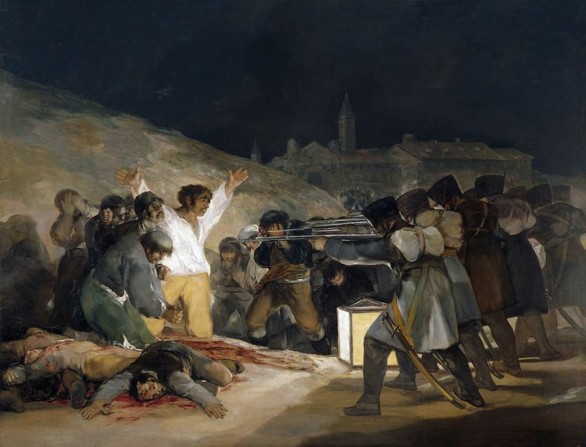

[🏠 Home](../../index.md)

# October 25

## 🧑‍🎨 Painting of the day

[Francisco Goya](http://en.wikipedia.org/wiki/Francisco_Goya) (Romanticism)

<button class="btn btn-success"
onclick=" window.open('https://lens.google.com/uploadbyurl?url=https://iretes.github.io/one-a-day/data/img/Francisco_Goya_4.jpg','_blank')">
Search with Google Lens
</button>

## 🎼 Song of the day

> *Chain of Fools*
by Aretha Franklin

 Written by Don Covay.

Released in Nov. , 1967.

<button class="btn btn-success"
onclick=" window.open('http://www.youtube.com/search?q=Chain of Fools by Aretha Franklin','_blank')">
Search on YouTube
</button>

## 🏛️ UNESCO heritage site of the day

> *The <I>Trulli</I> of Alberobello*, Italy

The <em>trulli</em> , limestone dwellings found in the southern region of Puglia, are remarkable examples of drywall (mortarless) construction, a prehistoric building technique still in use in this region. The <em>trulli</em> are made of roughly worked limestone boulders collected from neighbouring fields. Characteristically, they feature pyramidal, domed or conical roofs built up of corbelled limestone slabs.

<button class="btn btn-success"
onclick=" window.open('http://www.google.com/search?q=The <I>Trulli</I> of Alberobello','_blank')">
Search on Google
</button>

## 🗺️ Place of the day

<iframe
src="https://www.mapcrunch.com"
name="mapcrunch"
width="500"
height="500"
allowTransparency="true"
scrolling="no"
frameborder="0"
>
</iframe>
## 🎨 Color of the day

> *[Smitten](https://en.wikipedia.org/wiki/Red-violet#Smitten)*

&#9632;

## 🌿 Plant of the day

> *cork oak*

<button class="btn btn-success"
onclick=" window.open('http://www.google.com/search?q=cork oak','_blank')">
Search on Google
</button>

## 🧑‍🔬 Scientific discovery of the day

> *1912: Max von Laue: x-ray diffraction*

<button class="btn btn-success"
onclick=" window.open('http://www.google.com/search?q=1912: Max von Laue: x-ray diffraction','_blank')">
Search on Google
</button>

## 💭 Philosophical concept of the day

> *[Maya](https://en.wikipedia.org/wiki/Maya_(illusion))*

## 🗣️ Saying of the day

> *Double cross*

An act of treachery, perpetrated on a previous partner in a deceit.
