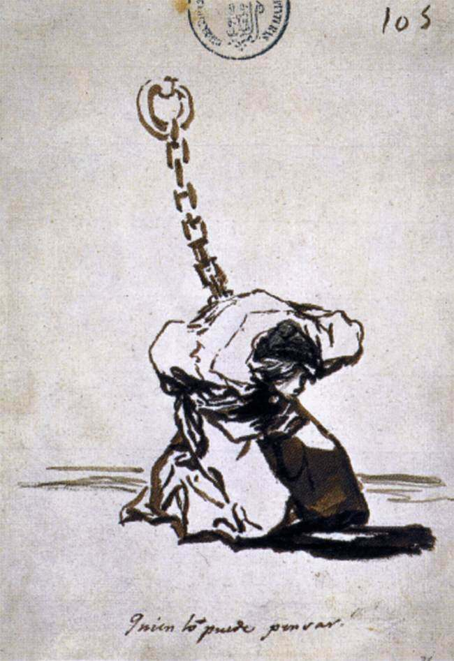

[🏠 Home](../../index.md)

# October 27

## 🧑‍🎨 Painting of the day

[Francisco Goya](http://en.wikipedia.org/wiki/Francisco_Goya) (Romanticism)

<button class="btn btn-success"
onclick=" window.open('https://lens.google.com/uploadbyurl?url=https://iretes.github.io/one-a-day/data/img/Francisco_Goya_5.jpg','_blank')">
Search with Google Lens
</button>

## 🎼 Song of the day

> *The Harder They Come*
by Jimmy Cliff

 Written by Cliff.

Released in March , 1975.

<button class="btn btn-success"
onclick=" window.open('http://www.youtube.com/search?q=The Harder They Come by Jimmy Cliff','_blank')">
Search on YouTube
</button>

## 🏛️ UNESCO heritage site of the day

> *Venetian Works of Defence between the 16th and 17th Centuries: <em>Stato da Terra</em> – Western <em>Stato da Mar</em>*, Croatia,Italy,Montenegro

This property consists of 6 components of defence works in Italy, Croatia and Montenegro, spanning more than 1,000 km between the Lombard region of Italy and the eastern Adriatic Coast. The fortifications throughout the <em>Stato da Terra </em>protected the Republic of Venice from other European powers to the northwest and those of the <em>Stato da Mar </em>protected the sea routes and ports in the Adriatic Sea to the Levant. They were necessary to support the expansion and authority of the <em>Serenissima</em>. The introduction of gunpowder led to significant shifts in military techniques and architecture that are reflected in the design of so-called <em>alla moderna /</em><em> </em>bastioned, fortifications, which were to spread throughout Europe.

<button class="btn btn-success"
onclick=" window.open('http://www.google.com/search?q=Venetian Works of Defence between the 16th and 17th Centuries: <em>Stato da Terra</em> – Western <em>Stato da Mar</em>','_blank')">
Search on Google
</button>

## 🗺️ Place of the day

<iframe
src="https://www.mapcrunch.com"
name="mapcrunch"
width="500"
height="500"
allowTransparency="true"
scrolling="no"
frameborder="0"
>
</iframe>
## 🎨 Color of the day

> *[Purple Plum](https://en.wikipedia.org/wiki/List_of_Crayola_crayon_colors#Heads_&#39;n_Tails)*

&#9632;

## 🌿 Plant of the day

> *brittle bush*

<button class="btn btn-success"
onclick=" window.open('http://www.google.com/search?q=brittle bush','_blank')">
Search on Google
</button>

## 🧑‍🔬 Scientific discovery of the day

> *2021: China sends Nie Haisheng, Liu Boming and Tang Hongbo to assemble and then occupy and work aboard the Tiangong space station.*

<button class="btn btn-success"
onclick=" window.open('http://www.google.com/search?q=2021: China sends Nie Haisheng, Liu Boming and Tang Hongbo to assemble and then occupy and work aboard the Tiangong space station.','_blank')"> 
Search on Google
</button>

## 💭 Philosophical concept of the day

> *[Vajrayana](https://en.wikipedia.org/wiki/Vajrayana)*

## 🗣️ Saying of the day

> *Name and shame*

The publication of the identity of a person or group that is culpable in some anti-social act in order to shame them into remorse. 

## 🏳️‍🌈 International day

World Day for Audiovisual Heritage.