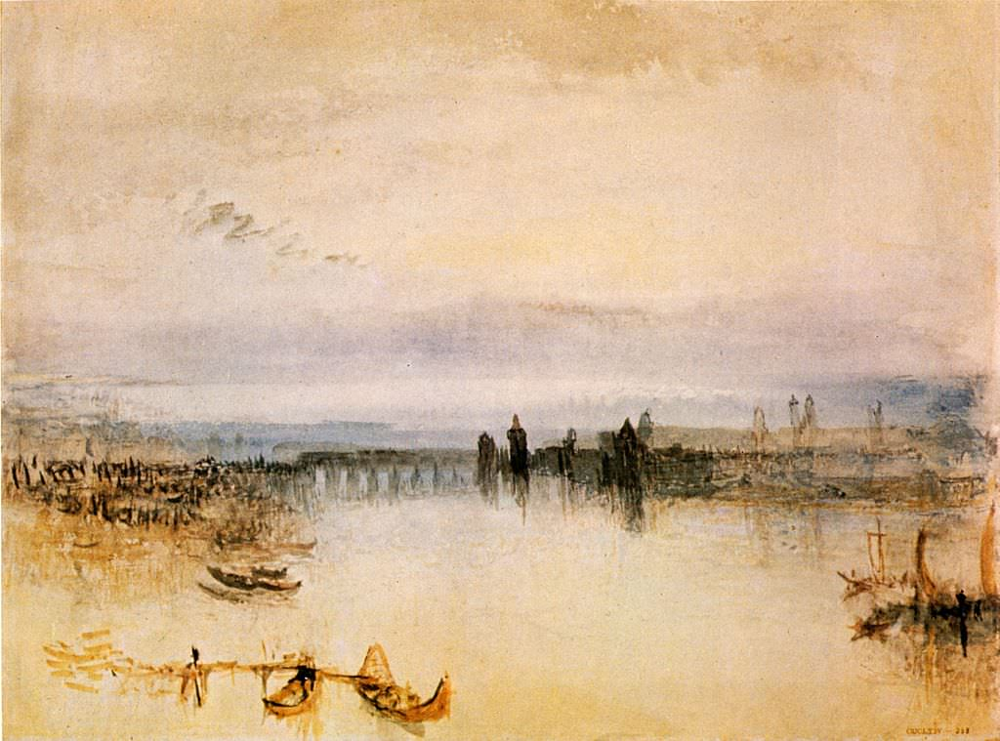

[🏠 Home](../../index.md)

# October 28

## 🧑‍🎨 Painting of the day

[William Turner](https://en.wikipedia.org/wiki/J._M._W._Turner) (Romanticism)

<button class="btn btn-success"
onclick=" window.open('https://lens.google.com/uploadbyurl?url=https://iretes.github.io/one-a-day/data/img/William_Turner_7.jpg','_blank')">
Search with Google Lens
</button>

## 🎼 Song of the day

> *Baba ORiley*
by The Who

 Written by Pete Townshend.

Released in Aug. , 1971.

<button class="btn btn-success"
onclick=" window.open('http://www.youtube.com/search?q=Baba ORiley by The Who','_blank')">
Search on YouTube
</button>

## 🏛️ UNESCO heritage site of the day

> *Sangha Trinational*, Cameroon,Central African Republic,Congo

Situated in the north-western Congo Basin, where Cameroon, Central African Republic and Congo meet, the site encompasses three contiguous national parks totalling around 750,000 ha. Much of the site is unaffected by human activity and features a wide range of humid tropical forest ecosystems with rich flora and fauna, including Nile crocodiles and goliath tigerfish, a large predator. Forest clearings support herbaceous species and Sangha is home to considerable populations of forest elephants, critically endangered western lowland gorilla, and endangered chimpanzee. The site’s environment has preserved the continuation of ecological and evolutionary processes on a huge scale and great biodiversity, including many endangered animal species.

<button class="btn btn-success"
onclick=" window.open('http://www.google.com/search?q=Sangha Trinational','_blank')">
Search on Google
</button>

## 🗺️ Place of the day

<iframe
src="https://www.mapcrunch.com"
name="mapcrunch"
width="500"
height="500"
allowTransparency="true"
scrolling="no"
frameborder="0"
>
</iframe>
## 🎨 Color of the day

> *[French lilac](https://en.wikipedia.org/wiki/Lilac_(color)#French_lilac)*

&#9632;

## 🌿 Plant of the day

> *california black oak*

<button class="btn btn-success"
onclick=" window.open('http://www.google.com/search?q=california black oak','_blank')">
Search on Google
</button>

## 🧑‍🔬 Scientific discovery of the day

> *2023: On 23 August, Chandrayaan-3 successfully touches down in the lunar south pole region making India the fourth country to successfully land on the Moon, and the first to do so near the lunar south pole.*

<button class="btn btn-success"
onclick=" window.open('http://www.google.com/search?q=2023: On 23 August, Chandrayaan-3 successfully touches down in the lunar south pole region making India the fourth country to successfully land on the Moon, and the first to do so near the lunar south pole.','_blank')">
Search on Google
</button>

## 💭 Philosophical concept of the day

> *[Language game](https://en.wikipedia.org/wiki/Language_game_(philosophy))*

## 🗣️ Saying of the day

> *Derring-do*

Heroic daring. 
