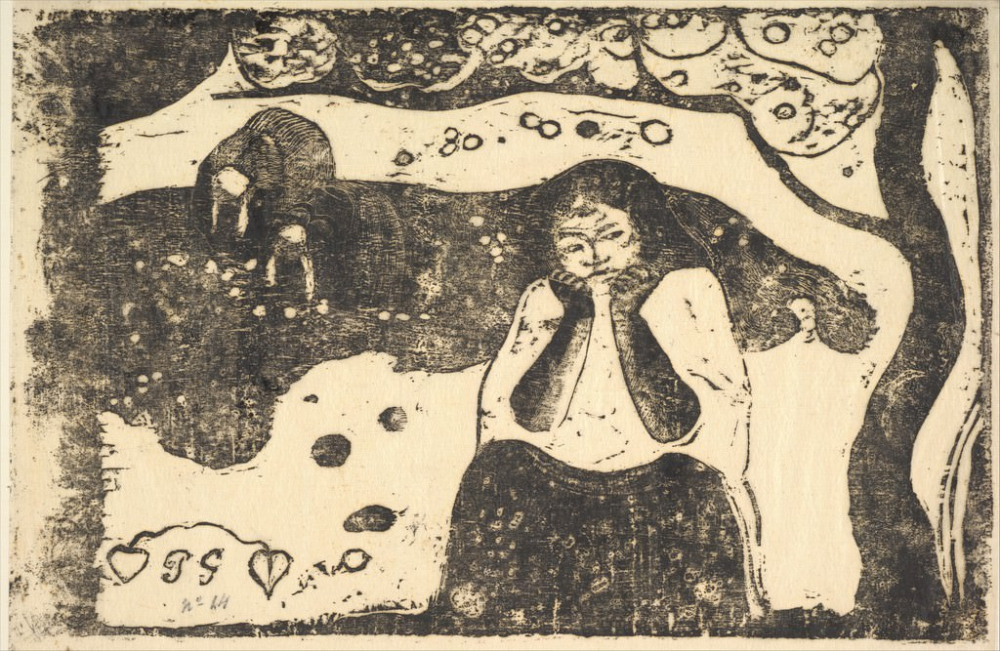

[🏠 Home](../../index.md)

# October 29

## 🧑‍🎨 Painting of the day

[Paul Gauguin](http://en.wikipedia.org/wiki/Paul_Gauguin) (Symbolism, Post-Impressionism)

<button class="btn btn-success"
onclick=" window.open('https://lens.google.com/uploadbyurl?url=https://iretes.github.io/one-a-day/data/img/Paul_Gauguin_6.jpg','_blank')">
Search with Google Lens
</button>

## 🎼 Song of the day

> *You Keep Me Hanging On*
by The Supremes

 Written by Brian Holland,Lamont Dozier, Eddie Holland.

Released in Oct. , 1966.

<button class="btn btn-success"
onclick=" window.open('http://www.youtube.com/search?q=You Keep Me Hanging On by The Supremes','_blank')">
Search on YouTube
</button>

## 🏛️ UNESCO heritage site of the day

> *Upper Middle Rhine Valley*, Germany

The 65km-stretch of the Middle Rhine Valley, with its castles, historic towns and vineyards, graphically illustrates the long history of human involvement with a dramatic and varied natural landscape. It is intimately associated with history and legend and for centuries has exercised a powerful influence on writers, artists and composers.

<button class="btn btn-success"
onclick=" window.open('http://www.google.com/search?q=Upper Middle Rhine Valley','_blank')">
Search on Google
</button>

## 🗺️ Place of the day

<iframe
src="https://www.mapcrunch.com"
name="mapcrunch"
width="500"
height="500"
allowTransparency="true"
scrolling="no"
frameborder="0"
>
</iframe>
## 🎨 Color of the day

> *[Gold (Crayola)](https://en.wikipedia.org/wiki/Gold_(color)#Pale_gold)*

&#9632;

## 🌿 Plant of the day

> *european holly*

<button class="btn btn-success"
onclick=" window.open('http://www.google.com/search?q=european holly','_blank')">
Search on Google
</button>

## 🧑‍🔬 Scientific discovery of the day

> *1938: Otto Hahn, Lise Meitner and Fritz Strassmann: Nuclear fission of heavy nuclei*

<button class="btn btn-success"
onclick=" window.open('http://www.google.com/search?q=1938: Otto Hahn, Lise Meitner and Fritz Strassmann: Nuclear fission of heavy nuclei','_blank')"> 
Search on Google
</button>

## 💭 Philosophical concept of the day

> *[Darshana](https://en.wikipedia.org/wiki/Darshana)*

## 🗣️ Saying of the day

> *Local derby*

A sporting contest between rivals from the same district. Often referring to football (soccer) matches.

## 🏳️‍🌈 International day

International Day of Care and Support.