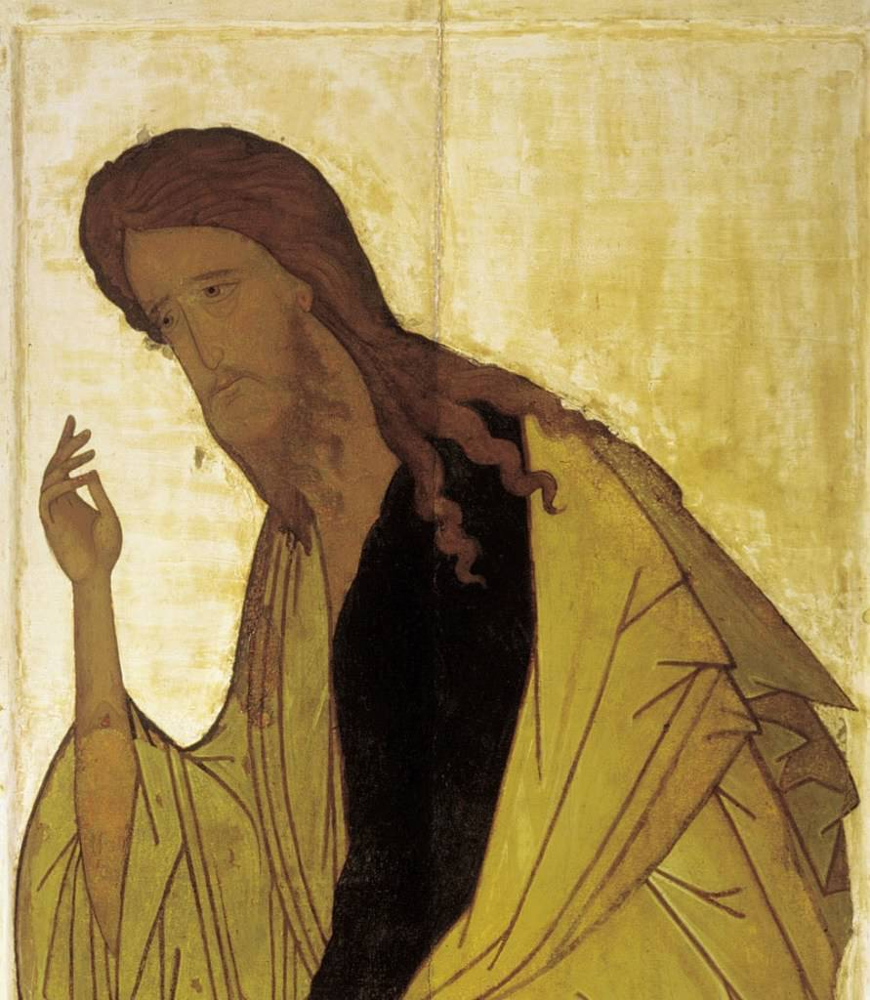

[🏠 Home](../../index.md)

# October 3

## 🧑‍🎨 Painting of the day

[Andrei Rublev](http://en.wikipedia.org/wiki/Andrei_Rublev) (Byzantine Art)

<button class="btn btn-success"
onclick=" window.open('https://lens.google.com/uploadbyurl?url=https://iretes.github.io/one-a-day/data/img/Andrei_Rublev_3.jpg','_blank')">
Search with Google Lens
</button>

## 🎼 Song of the day

> *Roadrunner*
by The Modern Lovers

 Written by Jonathan Richman.

Released in Oct. , 1976.

<button class="btn btn-success"
onclick=" window.open('http://www.youtube.com/search?q=Roadrunner by The Modern Lovers','_blank')">
Search on YouTube
</button>

## 🏛️ UNESCO heritage site of the day

> *Historic City of Ahmadabad*, India

The walled city of Ahmadabad, founded by Sultan Ahmad Shah in the 15th century, on the eastern bank of the Sabarmati river, presents a rich architectural heritage from the sultanate period, notably the Bhadra citadel, the walls and gates of the Fort city and numerous mosques and tombs as well as important Hindu and Jain temples of later periods. The urban fabric is made up of densely-packed traditional houses (<em>pols</em>) in gated traditional streets (<em>puras</em>) with characteristic features such as bird feeders, public wells and religious institutions. The city continued to flourish as the capital of the State of Gujarat for six centuries, up to the present.

<button class="btn btn-success"
onclick=" window.open('http://www.google.com/search?q=Historic City of Ahmadabad','_blank')">
Search on Google
</button>

## 🗺️ Place of the day

<iframe
src="https://www.mapcrunch.com"
name="mapcrunch"
width="500"
height="500"
allowTransparency="true"
scrolling="no"
frameborder="0"
>
</iframe>
## 🎨 Color of the day

> *[International orange (engineering)](https://en.wikipedia.org/wiki/International_orange#International_orange_(Engineering))*

&#9632;

## 🌿 Plant of the day

> *blue oak*

<button class="btn btn-success"
onclick=" window.open('http://www.google.com/search?q=blue oak','_blank')">
Search on Google
</button>

## 🧑‍🔬 Scientific discovery of the day

> *2nd century: Ptolemy publishes his Optics, discussing colour, reflection, and refraction of light, and including the first known table of refractive angles.*

<button class="btn btn-success"
onclick=" window.open('http://www.google.com/search?q=2nd century: Ptolemy publishes his Optics, discussing colour, reflection, and refraction of light, and including the first known table of refractive angles.','_blank')">
Search on Google
</button>

## 💭 Philosophical concept of the day

> *[Avadhuta](https://en.wikipedia.org/wiki/Avadhuta)*

## 🗣️ Saying of the day

> *Club sandwich*

A club sandwich is a sandwich of bread, sometimes toasted, and several other ingredients, often chicken or turkey,  bacon, lettuce, tomato, and mayonnaise. The sandwiches are usually cut into halves or quarters to form small triangles.
