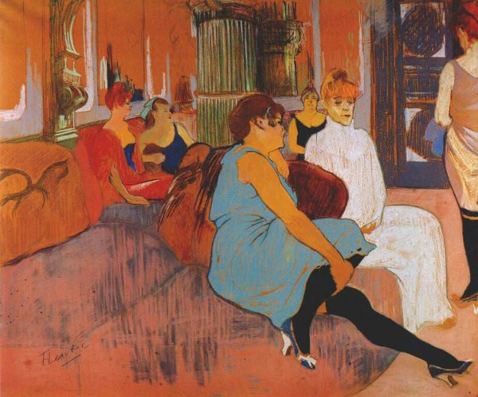

[🏠 Home](../../index.md)

# October 30

## 🧑‍🎨 Painting of the day

[Henri de Toulouse-Lautrec](https://en.wikipedia.org/wiki/Henri_de_Toulouse-Lautrec) (Post-Impressionism)

<button class="btn btn-success"
onclick=" window.open('https://lens.google.com/uploadbyurl?url=https://iretes.github.io/one-a-day/data/img/Henri_de_Toulouse-Lautrec_8.jpg','_blank')">
Search with Google Lens
</button>

## 🎼 Song of the day

> *Maybe Im Amazed*
by Paul McCartney

 Written by McCartney.

Released in April , 1970.

<button class="btn btn-success"
onclick=" window.open('http://www.youtube.com/search?q=Maybe Im Amazed by Paul McCartney','_blank')">
Search on YouTube
</button>

## 🏛️ UNESCO heritage site of the day

> *Osun-Osogbo Sacred Grove*, Nigeria

The dense forest of the Osun Sacred Grove, on the outskirts of the city of Osogbo, is one of the last remnants of primary high forest in southern Nigeria. Regarded as the abode of the goddess of fertility Osun, one of the pantheon of Yoruba gods, the landscape of the grove and its meandering river is dotted with sanctuaries and shrines, sculptures and art works in honour of Osun and other deities. The sacred grove, which is now seen as a symbol of identity for all Yoruba people, is probably the last in Yoruba culture. It testifies to the once widespread practice of establishing sacred groves outside all settlements.

<button class="btn btn-success"
onclick=" window.open('http://www.google.com/search?q=Osun-Osogbo Sacred Grove','_blank')">
Search on Google
</button>

## 🗺️ Place of the day

<iframe
src="https://www.mapcrunch.com"
name="mapcrunch"
width="500"
height="500"
allowTransparency="true"
scrolling="no"
frameborder="0"
>
</iframe>
## 🎨 Color of the day

> *[Technobotanica](https://en.wikipedia.org/wiki/Shades_of_cyan#Technobotanica)*

&#9632;

## 🌿 Plant of the day

> *brown daisy*

<button class="btn btn-success"
onclick=" window.open('http://www.google.com/search?q=brown daisy','_blank')">
Search on Google
</button>

## 🧑‍🔬 Scientific discovery of the day

> *1932: Ernest Walton and John Cockcroft: Nuclear fission by proton bombardment*

<button class="btn btn-success"
onclick=" window.open('http://www.google.com/search?q=1932: Ernest Walton and John Cockcroft: Nuclear fission by proton bombardment','_blank')"> 
Search on Google
</button>

## 💭 Philosophical concept of the day

> *[Matter](https://en.wikipedia.org/wiki/Matter_(philosophy))*

## 🗣️ Saying of the day

> *(Too big for your) boots*

Conceited; having a too high opinion of oneself. 
