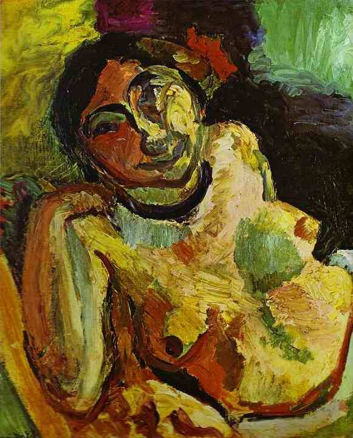

[🏠 Home](../../index.md)

# October 5

## 🧑‍🎨 Painting of the day

[Henri Matisse](http://en.wikipedia.org/wiki/Henri_Matisse) (Impressionism, Post-Impressionism)

<button class="btn btn-success"
onclick=" window.open('https://lens.google.com/uploadbyurl?url=https://iretes.github.io/one-a-day/data/img/Henri_Matisse_1.jpg','_blank')">
Search with Google Lens
</button>

## 🎼 Song of the day

> *Sunday Bloody Sunday*
by U2

 Written by Bono, the Edge, Adam Clayton, Larry Mullen Jr..

Released in March , 1983.

<button class="btn btn-success"
onclick=" window.open('http://www.youtube.com/search?q=Sunday Bloody Sunday by U2','_blank')">
Search on YouTube
</button>

## 🏛️ UNESCO heritage site of the day

> *Bursa and Cumalıkızık: the Birth of the Ottoman Empire*, Turkey

This property is a serial nomination of eight component sites in the City of Bursa and the nearby village of Cumalıkızık, in the southern Marmara region. The site illustrates the creation of an urban and rural system establishing the Ottoman Empire in the early 14th century. The property embodies the key functions of the social and economic organization of the new capital which evolved around a civic centre. These include commercial districts of khans, <em>kulliyes</em> (religious institutions) integrating mosques, religious schools, public baths and a kitchen for the poor, as well as the tomb of Orhan Ghazi, founder of the Ottoman dynasty. One component outside the historic centre of Bursa is the village of Cumalıkızık, the only rural village of this system to show the provision of hinterland support for the capital.

<button class="btn btn-success"
onclick=" window.open('http://www.google.com/search?q=Bursa and Cumalıkızık: the Birth of the Ottoman Empire','_blank')">
Search on Google
</button>

## 🗺️ Place of the day

<iframe
src="https://www.mapcrunch.com"
name="mapcrunch"
width="500"
height="500"
allowTransparency="true"
scrolling="no"
frameborder="0"
>
</iframe>
## 🎨 Color of the day

> *[Maximum yellow red](https://en.wikipedia.org/wiki/List_of_Crayola_crayon_colors#Standard_colors)*

&#9632;

## 🌿 Plant of the day

> *tansy*

<button class="btn btn-success"
onclick=" window.open('http://www.google.com/search?q=tansy','_blank')">
Search on Google
</button>

## 🧑‍🔬 Scientific discovery of the day

> *1669: Jan Swammerdam: epigenesis in insects.*

<button class="btn btn-success"
onclick=" window.open('http://www.google.com/search?q=1669: Jan Swammerdam: epigenesis in insects.','_blank')">
Search on Google
</button>

## 💭 Philosophical concept of the day

> *[Ideological repression](https://en.wikipedia.org/wiki/Ideological_repression)*

## 🗣️ Saying of the day

> *Deus ex machina*

Something or someone that comes in the nick of time to solve a difficulty, especially in works of fiction.

## 🏳️‍🌈 International day

World Teachers’ Day.