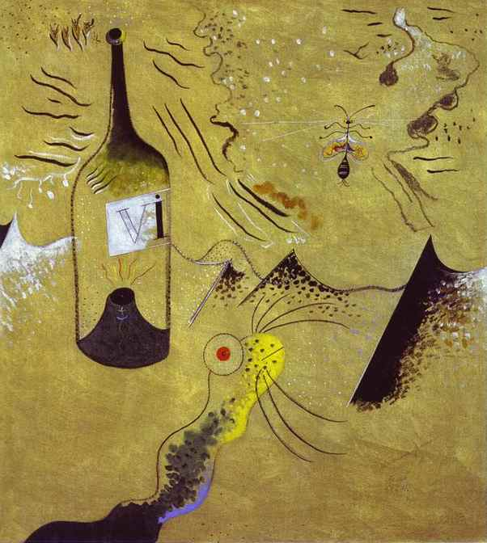

[🏠 Home](../../index.md)

# October 6

## 🧑‍🎨 Painting of the day

[Joan Miro](https://en.wikipedia.org/wiki/Joan_Miró) (Surrealism)

<button class="btn btn-success"
onclick=" window.open('https://lens.google.com/uploadbyurl?url=https://iretes.github.io/one-a-day/data/img/Joan_Miro_1.jpg','_blank')">
Search with Google Lens
</button>

## 🎼 Song of the day

> *Personality Crisis*
by New York Dolls

 Written by David Johansen, Johnny Thunders.

Released in Aug. , 1973.

<button class="btn btn-success"
onclick=" window.open('http://www.youtube.com/search?q=Personality Crisis by New York Dolls','_blank')">
Search on YouTube
</button>

## 🏛️ UNESCO heritage site of the day

> *Xinjiang Tianshan*, China

Xinjiang Tianshan&nbsp;comprises four components&mdash;Tomur, Kalajun-Kuerdening, Bayinbukuke and Bogda&mdash; that total 606,833 hectares. They are part of the Tianshan mountain system of Central Asia, one of the largest mountain ranges in the world. Xinjiang Tianshan presents unique physical geographic features and scenically beautiful areas including spectacular snow and snowy mountains glacier-capped peaks, undisturbed forests and meadows, clear rivers and lakes and red bed canyons. These landscapes contrast with the vast adjacent desert landscapes, creating a striking visual contrast between hot and cold environments, dry and wet, desolate and luxuriant. The landforms and ecosystems of the site have been preserved since the Pliocene epoch and present an outstanding example of ongoing biological and ecological evolutionary processes. The site also extends into the Taklimakan Desert, one of the world&rsquo;s largest and highest deserts, known for its large dune forms and great dust storms. Xinjiang Tianshan is moreover an important habitat for endemic and relic flora species, some rare and endangered.

<button class="btn btn-success"
onclick=" window.open('http://www.google.com/search?q=Xinjiang Tianshan','_blank')">
Search on Google
</button>

## 🗺️ Place of the day

<iframe
src="https://www.mapcrunch.com"
name="mapcrunch"
width="500"
height="500"
allowTransparency="true"
scrolling="no"
frameborder="0"
>
</iframe>
## 🎨 Color of the day

> *[Yellow (Crayola)](https://en.wikipedia.org/wiki/Shades_of_yellow#Yellow_(Crayola))*

&#9632;

## 🌿 Plant of the day

> *swallow wort*

<button class="btn btn-success"
onclick=" window.open('http://www.google.com/search?q=swallow wort','_blank')">
Search on Google
</button>

## 🧑‍🔬 Scientific discovery of the day

> *1980: Klaus von Klitzing discovered the quantum Hall effect*

<button class="btn btn-success"
onclick=" window.open('http://www.google.com/search?q=1980: Klaus von Klitzing discovered the quantum Hall effect','_blank')">
Search on Google
</button>

## 💭 Philosophical concept of the day

> *[Suffering](https://en.wikipedia.org/wiki/Suffering)*

## 🗣️ Saying of the day

> *Carpe diem*

'Carpe diem' is usually translated from the Latin as 'seize the day'. However, the more pedantic of Latin scholars may very well seize you by the throat if you suggest that translation. 
