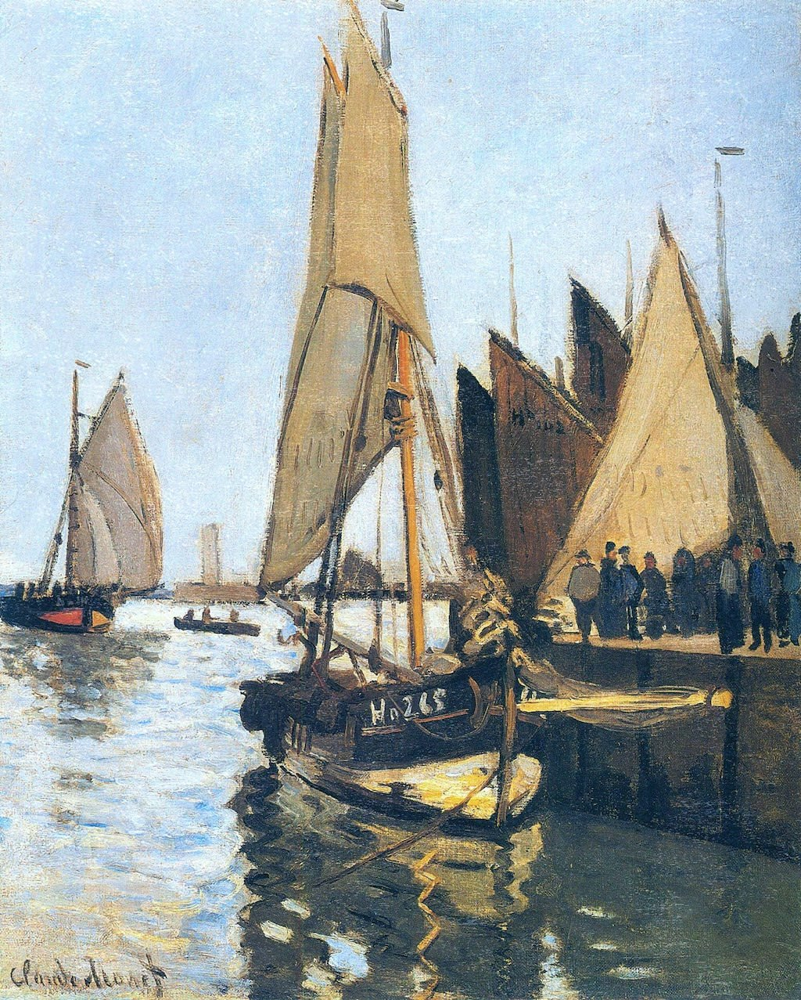

[🏠 Home](../../index.md)

# October 7

## 🧑‍🎨 Painting of the day

[Claude Monet](http://en.wikipedia.org/wiki/Claude_Monet) (Impressionism)

<button class="btn btn-success"
onclick=" window.open('https://lens.google.com/uploadbyurl?url=https://iretes.github.io/one-a-day/data/img/Claude_Monet_2.jpg','_blank')">
Search with Google Lens
</button>

## 🎼 Song of the day

> *Tighten Up*
by Archie Bell and The Drells

 Written by Bell, Billy Butler.

Released in March , 1968.

<button class="btn btn-success"
onclick=" window.open('http://www.youtube.com/search?q=Tighten Up by Archie Bell and The Drells','_blank')">
Search on YouTube
</button>

## 🏛️ UNESCO heritage site of the day

> *Decorated Cave of Pont d’Arc, known as Grotte Chauvet-Pont d’Arc, Ardèche*, France

Located in a limestone plateau of the Ardèche River in southern France, the property contains the earliest-known and best-preserved figurative drawings in the world, dating back as early as the Aurignacian period (30,000–32,000 BP), making it an exceptional testimony of prehistoric art. The cave was closed off by a rock fall approximately 20,000 years BP and remained sealed until its discovery in 1994, which helped to keep it in pristine condition. Over 1,000 images have so far been inventoried on its walls, combining a variety of anthropomorphic and animal motifs. Of exceptional aesthetic quality, they demonstrate a range of techniques including the skilful use of shading, combinations of paint and engraving, anatomical precision, three-dimensionality and movement. They include several dangerous animal species difficult to observe at that time, such as mammoth, bear, cave lion, rhino, bison and auroch, as well as 4,000 inventoried remains of prehistoric fauna and a variety of human footprints.

<button class="btn btn-success"
onclick=" window.open('http://www.google.com/search?q=Decorated Cave of Pont d’Arc, known as Grotte Chauvet-Pont d’Arc, Ardèche','_blank')">
Search on Google
</button>

## 🗺️ Place of the day

<iframe
src="https://www.mapcrunch.com"
name="mapcrunch"
width="500"
height="500"
allowTransparency="true"
scrolling="no"
frameborder="0"
>
</iframe>
## 🎨 Color of the day

> *[Vanilla](https://en.wikipedia.org/wiki/Vanilla_(color))*

&#9632;

## 🌿 Plant of the day

> *wild cotton*

<button class="btn btn-success"
onclick=" window.open('http://www.google.com/search?q=wild cotton','_blank')">
Search on Google
</button>

## 🧑‍🔬 Scientific discovery of the day

> *1918: Emmy Noether: Noether's theorem – conditions under which the conservation laws are valid*

<button class="btn btn-success"
onclick=" window.open('http://www.google.com/search?q=1918: Emmy Noether: Noether s theorem – conditions under which the conservation laws are valid','_blank')">
Search on Google
</button>

## 💭 Philosophical concept of the day

> *[Freedom](https://en.wikipedia.org/wiki/Freedom)*

## 🗣️ Saying of the day

> *Up the wooden hill to Bedfordshire*

Go up the hill to Bedfordshire was phrase uttered to children in the UK when it was time to go upstairs to prepare for bed. The expression is now rather archaic and little-used.

## 🏳️‍🌈 International day

World Habitat Day, World Cotton Day.