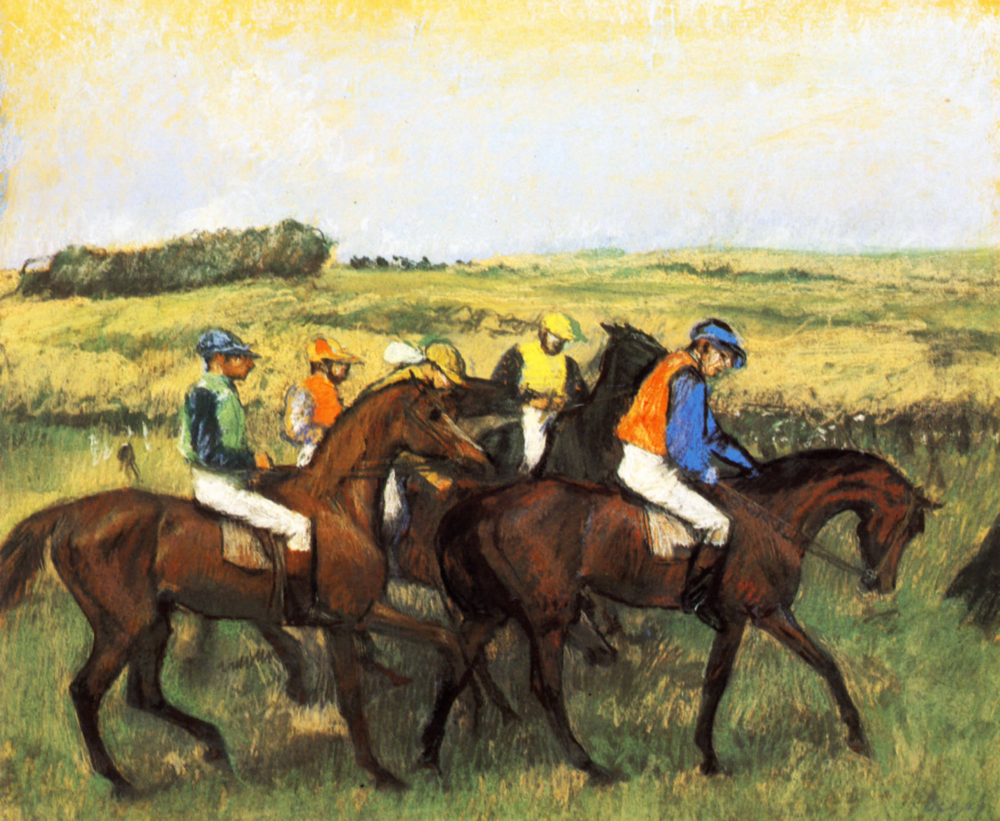

[🏠 Home](../../index.md)

# September 1

## 🧑‍🎨 Painting of the day

[Edgar Degas](http://en.wikipedia.org/wiki/Edgar_Degas) (Impressionism)

<button class="btn btn-success"
onclick=" window.open('https://lens.google.com/uploadbyurl?url=https://iretes.github.io/one-a-day/data/img/Edgar_Degas_4.jpg','_blank')">
Search with Google Lens
</button>

## 🎼 Song of the day

> *Positively 4th Street*
by Bob Dylan

 Written by Dylan.

Released in Sept. , 1965.

<button class="btn btn-success"
onclick=" window.open('http://www.youtube.com/search?q=Positively 4th Street by Bob Dylan','_blank')">
Search on YouTube
</button>

## 🏛️ UNESCO heritage site of the day

> *The Great Spa Towns of Europe*, Austria,Belgium,Czechia,France,Germany,Italy,United Kingdom of Great Britain and Northern Ireland

The transnational site of The Great Spa Towns of Europe comprises 11 towns, located in seven European countries: Baden bei Wien (Austria); Spa (Belgium); Františkovy Lázně (Czechia); Karlovy Vary (Czechia); Mariánské Lázně (Czechia); Vichy (France); Bad Ems (Germany); Baden-Baden (Germany); Bad Kissingen (Germany); Montecatini Terme (Italy); and City of Bath (United Kingdom). All of these towns developed around natural mineral water springs. They bear witness to the international European spa culture that developed from the early 18th century to the 1930s, leading to the emergence of grand international resorts that impacted urban typology around ensembles of spa buildings such as the kurhaus and kursaal (buildings and rooms dedicated to therapy), pump rooms, drinking halls, colonnades and galleries designed to harness the natural mineral water resources and to allow their practical use for bathing and drinking. Related facilities include gardens, assembly rooms, casinos, theatres, hotels and villas, as well as spa-specific support infrastructure. These ensembles are all integrated into an overall urban context that includes a carefully managed recreational and therapeutic environment in a picturesque landscape. Together, these sites embody the significant interchange of human values and developments in medicine, science and balneology.

<button class="btn btn-success"
onclick=" window.open('http://www.google.com/search?q=The Great Spa Towns of Europe','_blank')">
Search on Google
</button>

## 🗺️ Place of the day

<iframe
src="https://www.mapcrunch.com"
name="mapcrunch"
width="500"
height="500"
allowTransparency="true"
scrolling="no"
frameborder="0"
>
</iframe>
## 🎨 Color of the day

> *[Rocket metallic](https://en.wikipedia.org/wiki/Shades_of_gray#Rocket_metallic)*

&#9632;

## 🌿 Plant of the day

> *blueberry*

<button class="btn btn-success"
onclick=" window.open('http://www.google.com/search?q=blueberry','_blank')">
Search on Google
</button>

## 🧑‍🔬 Scientific discovery of the day

> *1856: Robert Forester Mushet develops a process for the decarbonisation, and re-carbonisation of iron, through the addition of a calculated quantity of spiegeleisen, to produce cheap, consistently high quality steel.*

<button class="btn btn-success"
onclick=" window.open('http://www.google.com/search?q=1856: Robert Forester Mushet develops a process for the decarbonisation, and re-carbonisation of iron, through the addition of a calculated quantity of spiegeleisen, to produce cheap, consistently high quality steel.','_blank')"> 
Search on Google
</button>

## 💭 Philosophical concept of the day

> *[Emergence](https://en.wikipedia.org/wiki/Emergence)*

## 🗣️ Saying of the day

> *By the skin of your teeth*

Narrowly; barely. Usually used in regard to a narrow escape from a disaster.
