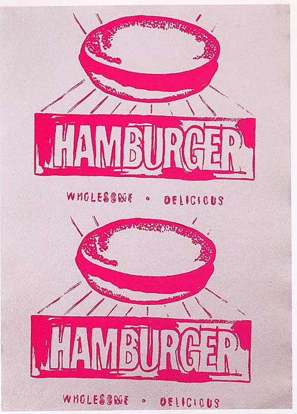

[🏠 Home](../../index.md)

# September 10

## 🧑‍🎨 Painting of the day

[Andy Warhol](https://en.wikipedia.org/wiki/Andy_Warhol) (Pop Art)

<button class="btn btn-success"
onclick=" window.open('https://lens.google.com/uploadbyurl?url=https://iretes.github.io/one-a-day/data/img/Andy_Warhol_7.jpg','_blank')">
Search with Google Lens
</button>

## 🎼 Song of the day

> *Shes Not There*
by The Zombies

 Written by Rod Argent.

Released in Oct. , 1964.

<button class="btn btn-success"
onclick=" window.open('http://www.youtube.com/search?q=Shes Not There by The Zombies','_blank')">
Search on YouTube
</button>

## 🏛️ UNESCO heritage site of the day

> *Sanctuary of Bom Jesus do Monte in Braga*, Portugal

Located on the slopes of Mount Espinho, overlooking the city of Braga in the north of Portugal, this cultural landscape evokes Christian Jerusalem, recreating a sacred mount crowned with a church. The sanctuary was developed over a period of more than 600 years, primarily in a Baroque style, and illustrates a European tradition of creating <em>Sacri Monti</em> (sacred mountains), promoted by the Catholic Church at the Council of Trent in the 16th century, in reaction to the Protestant Reformation. The Bom Jesus ensemble is centred on a <em>Via Crucis</em> that leads up the western slope of the mount. It includes a series of chapels that house sculptures evoking the Passion of Christ, as well as fountains, allegorical sculptures and formal gardens. The <em>Via Crucis</em> culminates at the church, which was built between 1784 and 1811. The granite buildings have whitewashed plaster façades, framed by exposed stonework. The celebrated Stairway of the Five Senses, with its walls, steps, fountains, statues and other ornamental elements, is the most emblematic Baroque work within the property. They are framed by lush woodland and embraced by a picturesque park that, masterfully set on the rugged hill, highly contributes to the landscape value of the ensemble.

<button class="btn btn-success"
onclick=" window.open('http://www.google.com/search?q=Sanctuary of Bom Jesus do Monte in Braga','_blank')">
Search on Google
</button>

## 🗺️ Place of the day

<iframe
src="https://www.mapcrunch.com"
name="mapcrunch"
width="500"
height="500"
allowTransparency="true"
scrolling="no"
frameborder="0"
>
</iframe>
## 🎨 Color of the day

> *[Pale aqua](https://en.wikipedia.org/wiki/Aqua_(color)#Pale_aqua)*

&#9632;

## 🌿 Plant of the day

> *duscle*

<button class="btn btn-success"
onclick=" window.open('http://www.google.com/search?q=duscle','_blank')">
Search on Google
</button>

## 🧑‍🔬 Scientific discovery of the day

> *1925: Cecilia Payne-Gaposchkin: Discovery of the composition of the Sun and that hydrogen is the most abundant element in the Universe*

<button class="btn btn-success"
onclick=" window.open('http://www.google.com/search?q=1925: Cecilia Payne-Gaposchkin: Discovery of the composition of the Sun and that hydrogen is the most abundant element in the Universe','_blank')">
Search on Google
</button>

## 💭 Philosophical concept of the day

> *[Absolute](https://en.wikipedia.org/wiki/Absolute_(philosophy))*

## 🗣️ Saying of the day

> *Sloane Ranger*

Sloane Rangers, or latterly just Sloanes or Sloanies are upper class and fashion-conscious but conventional young people, living in the more expensive parts of West London.
