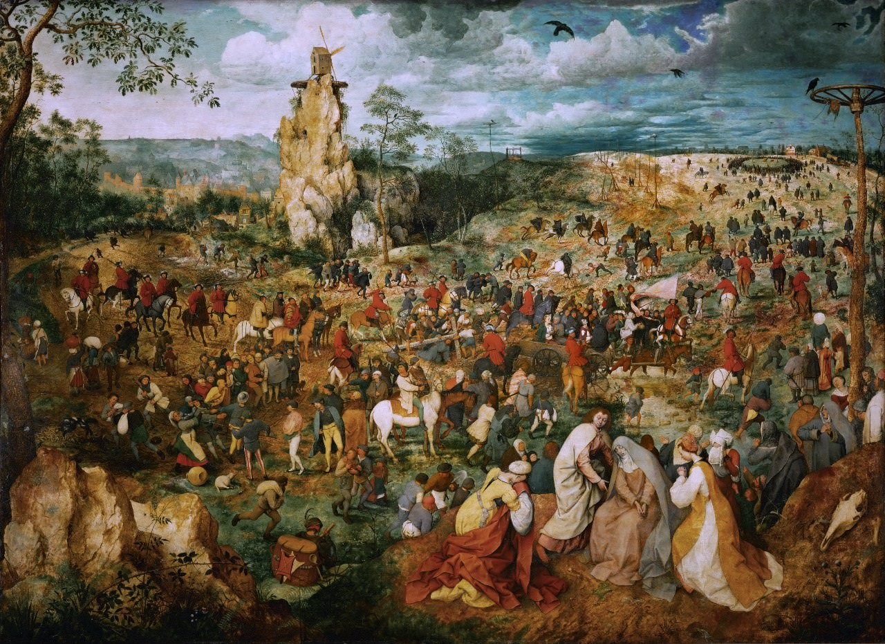

[🏠 Home](../../index.md)

# September 11

## 🧑‍🎨 Painting of the day

[Pieter Bruegel](http://en.wikipedia.org/wiki/Pieter_Bruegel_the_Elder) (Northern Renaissance)

<button class="btn btn-success"
onclick=" window.open('https://lens.google.com/uploadbyurl?url=https://iretes.github.io/one-a-day/data/img/Pieter_Bruegel_5.jpg','_blank')">
Search with Google Lens
</button>

## 🎼 Song of the day

> *Stan*
by Eminem feat. Dido

 Written by Marshall Mathers,D. Armstrong, P. Herman.

Released in March , 2000.

<button class="btn btn-success"
onclick=" window.open('http://www.youtube.com/search?q=Stan by Eminem feat. Dido','_blank')">
Search on YouTube
</button>

## 🏛️ UNESCO heritage site of the day

> *Ancient Villages in Southern Anhui – Xidi and Hongcun*, China

The two traditional villages of Xidi and Hongcun preserve to a remarkable extent the appearance of non-urban settlements of a type that largely disappeared or was transformed during the last century. Their street plan, their architecture and decoration, and the integration of houses with comprehensive water systems are unique surviving examples.

<button class="btn btn-success"
onclick=" window.open('http://www.google.com/search?q=Ancient Villages in Southern Anhui – Xidi and Hongcun','_blank')">
Search on Google
</button>

## 🗺️ Place of the day

<iframe
src="https://www.mapcrunch.com"
name="mapcrunch"
width="500"
height="500"
allowTransparency="true"
scrolling="no"
frameborder="0"
>
</iframe>
## 🎨 Color of the day

> *[Dark cyan](https://en.wikipedia.org/wiki/Shades_of_cyan#Dark_cyan)*

&#9632;

## 🌿 Plant of the day

> *keek*

<button class="btn btn-success"
onclick=" window.open('http://www.google.com/search?q=keek','_blank')">
Search on Google
</button>

## 🧑‍🔬 Scientific discovery of the day

> *1821: Thomas Johann Seebeck is the first to observe a property of semiconductors.*

<button class="btn btn-success"
onclick=" window.open('http://www.google.com/search?q=1821: Thomas Johann Seebeck is the first to observe a property of semiconductors.','_blank')"> 
Search on Google
</button>

## 💭 Philosophical concept of the day

> *[Category of being](https://en.wikipedia.org/wiki/Category_of_being)*

## 🗣️ Saying of the day

> *One over the eight*

The final drink that renders someone drunk.
