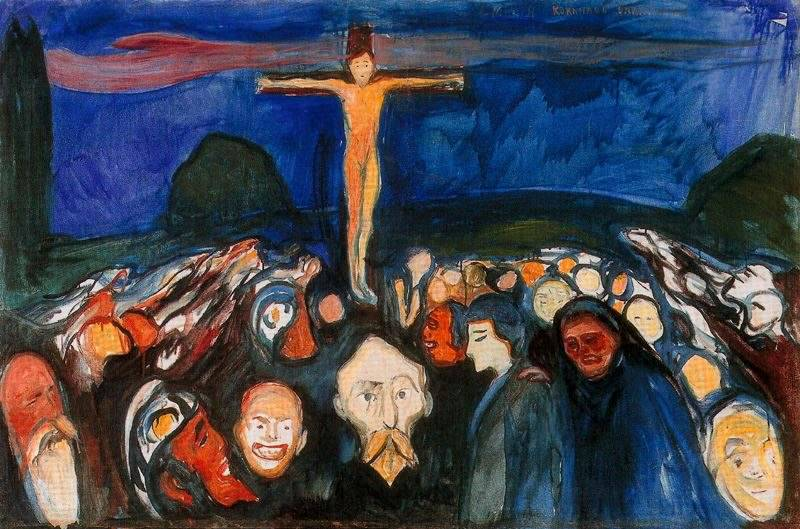

[🏠 Home](../../index.md)

# September 13

## 🧑‍🎨 Painting of the day

[Edvard Munch](https://en.wikipedia.org/wiki/Edvard_Munch) (Symbolism, Expressionism)

<button class="btn btn-success"
onclick=" window.open('https://lens.google.com/uploadbyurl?url=https://iretes.github.io/one-a-day/data/img/Edvard_Munch_6.jpg','_blank')">
Search with Google Lens
</button>

## 🎼 Song of the day

> *Money (Thats What I Want)*
by Barrett Strong

 Written by Berry Gordy, Janie Bradford.

Released in Jan. , 1960.

<button class="btn btn-success"
onclick=" window.open('http://www.youtube.com/search?q=Money (Thats What I Want) by Barrett Strong','_blank')">
Search on YouTube
</button>

## 🏛️ UNESCO heritage site of the day

> *Natural System of Wrangel Island Reserve*, Russian Federation

Located well above the Arctic Circle, the site includes the mountainous Wrangel Island (7,608 km2), Herald Island (11 km2) and surrounding waters. Wrangel was not glaciated during the Quaternary Ice Age, resulting in exceptionally high levels of biodiversity for this region. The island boasts the world’s largest population of Pacific walrus and the highest density of ancestral polar bear dens. It is a major feeding ground for the grey whale migrating from Mexico and the northernmost nesting ground for 100 migratory bird species, many endangered. Currently, 417 species and subspecies of vascular plants have been identified on the island, double that of any other Arctic tundra territory of comparable size and more than any other Arctic island. Some species are derivative of widespread continental forms, others are the result of recent hybridization, and 23 are endemic.

<button class="btn btn-success"
onclick=" window.open('http://www.google.com/search?q=Natural System of Wrangel Island Reserve','_blank')">
Search on Google
</button>

## 🗺️ Place of the day

<iframe
src="https://www.mapcrunch.com"
name="mapcrunch"
width="500"
height="500"
allowTransparency="true"
scrolling="no"
frameborder="0"
>
</iframe>
## 🎨 Color of the day

> *[Persian green](https://en.wikipedia.org/wiki/Shades_of_green#Persian_green)*

&#9632;

## 🌿 Plant of the day

> *sycamore*

<button class="btn btn-success"
onclick=" window.open('http://www.google.com/search?q=sycamore','_blank')">
Search on Google
</button>

## 🧑‍🔬 Scientific discovery of the day

> *1672: Sir Isaac Newton: discovers that white light is a mixture of distinct coloured rays (the spectrum).*

<button class="btn btn-success"
onclick=" window.open('http://www.google.com/search?q=1672: Sir Isaac Newton: discovers that white light is a mixture of distinct coloured rays (the spectrum).','_blank')"> 
Search on Google
</button>

## 💭 Philosophical concept of the day

> *[Philosophy of futility](https://en.wikipedia.org/wiki/Philosophy_of_futility)*

## 🗣️ Saying of the day

> *Pony up*

Pay  money, especially  a payment that is in arrears.
