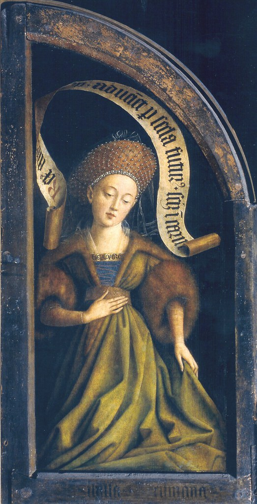

[🏠 Home](../../index.md)

# September 14

## 🧑‍🎨 Painting of the day

[Jan van Eyck](http://en.wikipedia.org/wiki/Jan_van_Eyck) (Northern Renaissance)

<button class="btn btn-success"
onclick=" window.open('https://lens.google.com/uploadbyurl?url=https://iretes.github.io/one-a-day/data/img/Jan_van_Eyck_7.jpg','_blank')">
Search with Google Lens
</button>

## 🎼 Song of the day

> *Walk This Way*
by Run-DMC

 Written by Steven Tyler, Joe Perry.

Released in May , 1986.

<button class="btn btn-success"
onclick=" window.open('http://www.youtube.com/search?q=Walk This Way by Run-DMC','_blank')">
Search on YouTube
</button>

## 🏛️ UNESCO heritage site of the day

> *Cultural Landscape of Honghe Hani Rice Terraces *, China

The Cultural Landscape of Honghe Hani Rice Terraces, China covers 16,603-hectares in Southern Yunnan. It is marked by spectacular terraces that cascade down the slopes of the towering Ailao Mountains to the banks of the Hong River. Over the past 1,300 years, the Hani people have developed a complex system of channels to bring water from the forested mountaintops to the terraces. They have also created an integrated farming system that involves buffalos, cattle, ducks, fish and eel and supports the production of red rice, the area&rsquo;s primary crop. The inhabitants worship the sun, moon, mountains, rivers, forests and other natural phenomena including fire. They live in 82 villages situated between the mountaintop forests and the terraces. The villages feature traditional thatched &ldquo;mushroom&rdquo; houses. The resilient land management system of the rice terraces demonstrates extraordinary harmony between people and their environment, both visually and ecologically, based on exceptional and long-standing social and religious structures.

<button class="btn btn-success"
onclick=" window.open('http://www.google.com/search?q=Cultural Landscape of Honghe Hani Rice Terraces ','_blank')">
Search on Google
</button>

## 🗺️ Place of the day

<iframe
src="https://www.mapcrunch.com"
name="mapcrunch"
width="500"
height="500"
allowTransparency="true"
scrolling="no"
frameborder="0"
>
</iframe>
## 🎨 Color of the day

> *[Russian violet](https://en.wikipedia.org/wiki/Shades_of_violet#Russian_violet)*

&#9632;

## 🌿 Plant of the day

> *roman wormwood*

<button class="btn btn-success"
onclick=" window.open('http://www.google.com/search?q=roman wormwood','_blank')">
Search on Google
</button>

## 🧑‍🔬 Scientific discovery of the day

> *1591: François Viète's New algebra shows the modern notational algebraic manipulation.*

<button class="btn btn-success"
onclick=" window.open('http://www.google.com/search?q=1591: François Viète s New algebra shows the modern notational algebraic manipulation.','_blank')">
Search on Google
</button>

## 💭 Philosophical concept of the day

> *[Work of art](https://en.wikipedia.org/wiki/Work_of_art)*

## 🗣️ Saying of the day

> *Fifteen minutes of fame*

This is a well-known as a quotation from Andy Warhol. It does derive from Warhol - his actual line was "In the future everybody will be world famous for fifteen minutes.".
