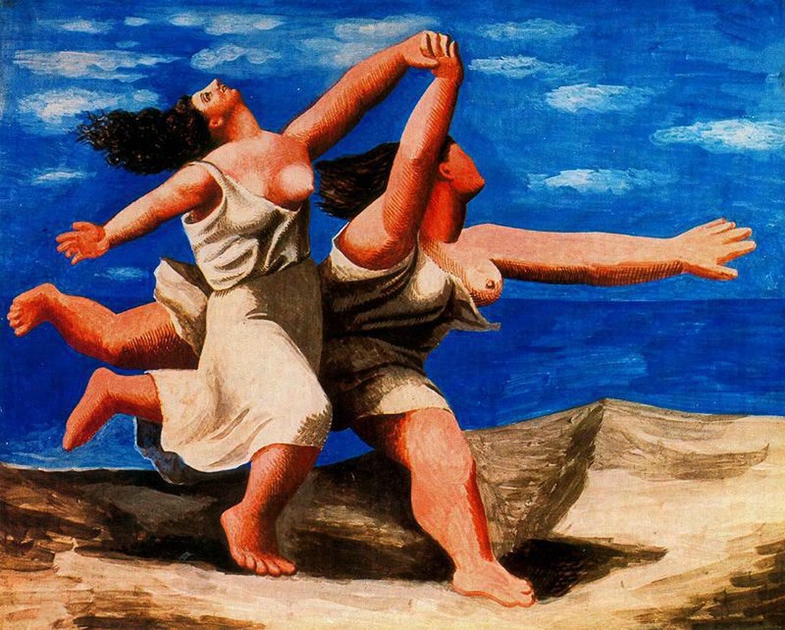

[🏠 Home](../../index.md)

# September 17

## 🧑‍🎨 Painting of the day

[Pablo Picasso](http://en.wikipedia.org/wiki/Pablo_Picasso) (Cubism)

<button class="btn btn-success"
onclick=" window.open('https://lens.google.com/uploadbyurl?url=https://iretes.github.io/one-a-day/data/img/Pablo_Picasso_3.jpg','_blank')">
Search with Google Lens
</button>

## 🎼 Song of the day

> *(Whats So Funny About) Peace*
by Elvis Costello and the Attractions

 Written by Nick Lowe.

Released in Jan. , 1979.

<button class="btn btn-success"
onclick=" window.open('http://www.youtube.com/search?q=(Whats So Funny About) Peace by Elvis Costello and the Attractions','_blank')">
Search on YouTube
</button>

## 🏛️ UNESCO heritage site of the day

> *Ephesus*, Turkey

Located within what was once the estuary of the River Kaystros, Ephesus comprises successive Hellenistic and Roman settlements founded on new locations, which followed the coastline as it retreated westward. Excavations have revealed grand monuments of the Roman Imperial period including the Library of Celsus and the Great Theatre. Little remains of the famous Temple of Artemis, one of the “Seven Wonders of the World,” which drew pilgrims from all around the Mediterranean. Since the 5th century, the House of the Virgin Mary, a domed cruciform chapel seven kilometres from Ephesus, became a major place of Christian pilgrimage. The Ancient City of Ephesus is an outstanding example of a Roman port city, with sea channel and harbour basin.

<button class="btn btn-success"
onclick=" window.open('http://www.google.com/search?q=Ephesus','_blank')">
Search on Google
</button>

## 🗺️ Place of the day

<iframe
src="https://www.mapcrunch.com"
name="mapcrunch"
width="500"
height="500"
allowTransparency="true"
scrolling="no"
frameborder="0"
>
</iframe>
## 🎨 Color of the day

> *[Lemon yellow](https://en.wikipedia.org/wiki/Lemon_(color)#Lemon_yellow)*

&#9632;

## 🌿 Plant of the day

> *water ash*

<button class="btn btn-success"
onclick=" window.open('http://www.google.com/search?q=water ash','_blank')">
Search on Google
</button>

## 🧑‍🔬 Scientific discovery of the day

> *1911: Ernest Rutherford: Atomic nucleus*

<button class="btn btn-success"
onclick=" window.open('http://www.google.com/search?q=1911: Ernest Rutherford: Atomic nucleus','_blank')"> 
Search on Google
</button>

## 💭 Philosophical concept of the day

> *[Nation](https://en.wikipedia.org/wiki/Nation)*

## 🗣️ Saying of the day

> *If it ain't broke, don't fix it*

If something is working adequately well, leave it alone. 

## 🏳️‍🌈 International day

World Patient Safety Day.