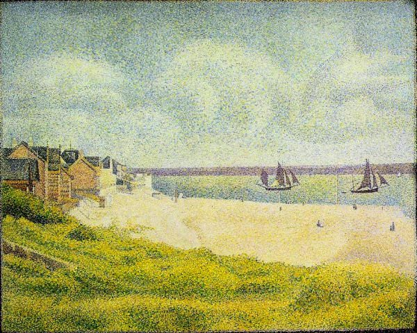

[🏠 Home](../../index.md)

# September 18

## 🧑‍🎨 Painting of the day

[Georges Seurat](https://en.wikipedia.org/wiki/Georges_Seurat) (Post-Impressionism)

<button class="btn btn-success"
onclick=" window.open('https://lens.google.com/uploadbyurl?url=https://iretes.github.io/one-a-day/data/img/Georges_Seurat_7.jpg','_blank')">
Search with Google Lens
</button>

## 🎼 Song of the day

> *Call Me*
by Blondie

 Written by Giorgio Moroder, Deborah Harry.

Released in Feb. , 1980.

<button class="btn btn-success"
onclick=" window.open('http://www.youtube.com/search?q=Call Me by Blondie','_blank')">
Search on YouTube
</button>

## 🏛️ UNESCO heritage site of the day

> *Heritage of Mercury. Almadén and Idrija*, Slovenia,Spain

The property includes the mining sites of Almad&eacute;n (Spain), where mercury (quicksilver) has been extracted since antiquity, and Idrija (Slovenia), where mercury was first found in AD1490. The Spanish property includes buildings relating to its mining history, including Retamar Castle, religious buildings and traditional dwellings. The site in Idrija notably features mercury stores and infrastructure, as well as miners&rsquo; living quarters, and a miners&rsquo; theatre. The sites bear testimony to the intercontinental trade in mercury which generated important exchanges between Europe and America over the centuries. Together they represent the two largest mercury mines in the world, operational until recent times.

<button class="btn btn-success"
onclick=" window.open('http://www.google.com/search?q=Heritage of Mercury. Almadén and Idrija','_blank')">
Search on Google
</button>

## 🗺️ Place of the day

<iframe
src="https://www.mapcrunch.com"
name="mapcrunch"
width="500"
height="500"
allowTransparency="true"
scrolling="no"
frameborder="0"
>
</iframe>
## 🎨 Color of the day

> *[Spanish viridian](https://en.wikipedia.org/wiki/Viridian#Spanish_viridian)*

&#9632;

## 🌿 Plant of the day

> *eastern redbud*

<button class="btn btn-success"
onclick=" window.open('http://www.google.com/search?q=eastern redbud','_blank')">
Search on Google
</button>

## 🧑‍🔬 Scientific discovery of the day

> *1995: Eric Cornell, Carl Wieman and Wolfgang Ketterle attained the first Bose-Einstein Condensate with atomic gases, so called fifth state of matter at an extremely low temperature.*

<button class="btn btn-success"
onclick=" window.open('http://www.google.com/search?q=1995: Eric Cornell, Carl Wieman and Wolfgang Ketterle attained the first Bose-Einstein Condensate with atomic gases, so called fifth state of matter at an extremely low temperature.','_blank')"> 
Search on Google
</button>

## 💭 Philosophical concept of the day

> *[Ecstasy](https://en.wikipedia.org/wiki/Ecstasy_(philosophy))*

## 🗣️ Saying of the day

> *Something nasty in the woodshed*

'Something nasty in the woodshed' is a traumatic but unspecified incident in someone's experience, or something  shocking or distasteful that has been  kept secret.

## 🏳️‍🌈 International day

International Equal Pay Day.