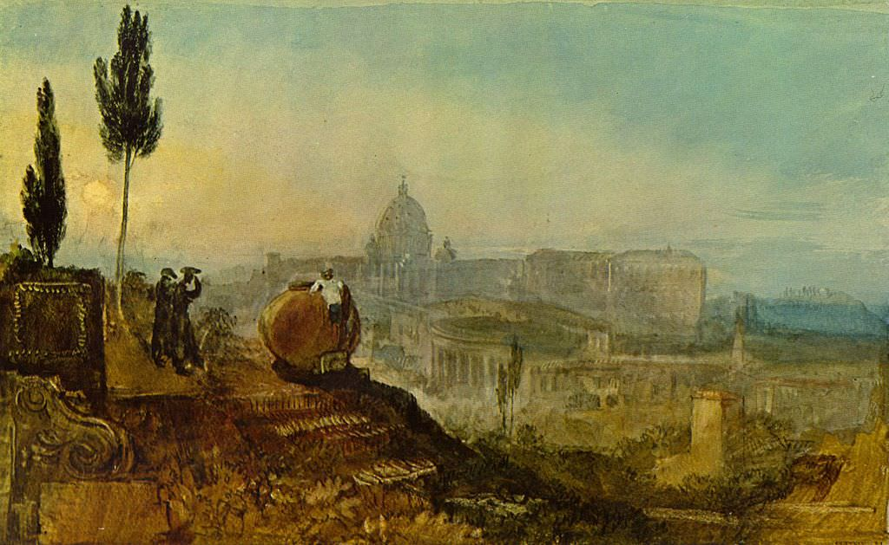

[🏠 Home](../../index.md)

# September 19

## 🧑‍🎨 Painting of the day

[William Turner](https://en.wikipedia.org/wiki/J._M._W._Turner) (Romanticism)

<button class="btn btn-success"
onclick=" window.open('https://lens.google.com/uploadbyurl?url=https://iretes.github.io/one-a-day/data/img/William_Turner_3.jpg','_blank')">
Search with Google Lens
</button>

## 🎼 Song of the day

> *Help Me*
by Joni Mitchell

 Written by Mitchell.

Released in Feb. , 1974.

<button class="btn btn-success"
onclick=" window.open('http://www.youtube.com/search?q=Help Me by Joni Mitchell','_blank')">
Search on YouTube
</button>

## 🏛️ UNESCO heritage site of the day

> *Tipasa*, Algeria

On the shores of the Mediterranean, Tipasa was an ancient Punic trading-post conquered by Rome and turned into a strategic base for the conquest of the kingdoms of Mauritania. It comprises a unique group of Phoenician, Roman, palaeochristian and Byzantine ruins alongside indigenous monuments such as the Kbor er Roumia, the great royal mausoleum of Mauretania.

<button class="btn btn-success"
onclick=" window.open('http://www.google.com/search?q=Tipasa','_blank')">
Search on Google
</button>

## 🗺️ Place of the day

<iframe
src="https://www.mapcrunch.com"
name="mapcrunch"
width="500"
height="500"
allowTransparency="true"
scrolling="no"
frameborder="0"
>
</iframe>
## 🎨 Color of the day

> *[Scarlet](https://en.wikipedia.org/wiki/Scarlet_(color))*

&#9632;

## 🌿 Plant of the day

> *new zealand flax*

<button class="btn btn-success"
onclick=" window.open('http://www.google.com/search?q=new zealand flax','_blank')">
Search on Google
</button>

## 🧑‍🔬 Scientific discovery of the day

> *1892: Dmitri Ivanovsky discovers viruses.*

<button class="btn btn-success"
onclick=" window.open('http://www.google.com/search?q=1892: Dmitri Ivanovsky discovers viruses.','_blank')"> 
Search on Google
</button>

## 💭 Philosophical concept of the day

> *[Empirical relationship](https://en.wikipedia.org/wiki/Empirical_relationship)*

## 🗣️ Saying of the day

> *Whipper snapper*

A diminutive or insignificant person, especially a sprightly or impertinent youngster.
