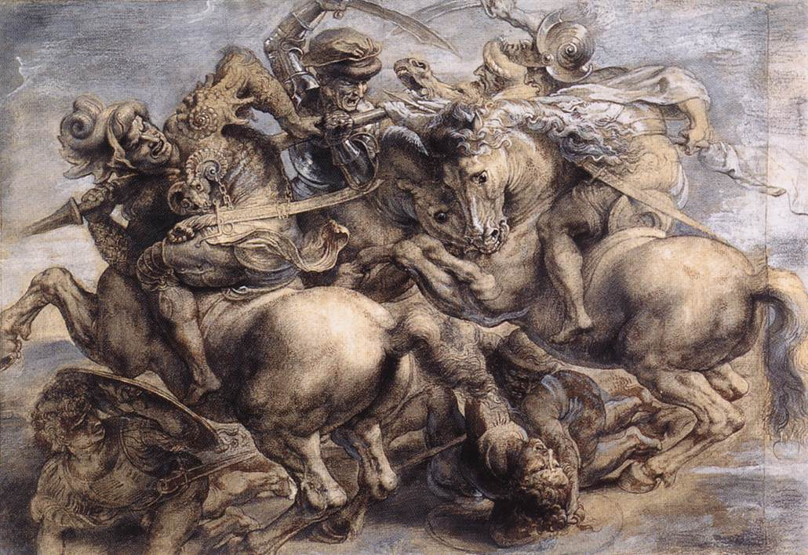

[🏠 Home](../../index.md)

# September 20

## 🧑‍🎨 Painting of the day

[Leonardo da Vinci](http://en.wikipedia.org/wiki/Leonardo_da_Vinci) (High Renaissance)

<button class="btn btn-success"
onclick=" window.open('https://lens.google.com/uploadbyurl?url=https://iretes.github.io/one-a-day/data/img/Leonardo_da_Vinci_7.jpg','_blank')">
Search with Google Lens
</button>

## 🎼 Song of the day

> *You Are the Sunshine of My Life*
by Stevie Wonder

 Written by Wonder.

Released in Nov. , 1972.

<button class="btn btn-success"
onclick=" window.open('http://www.youtube.com/search?q=You Are the Sunshine of My Life by Stevie Wonder','_blank')">
Search on YouTube
</button>

## 🏛️ UNESCO heritage site of the day

> *Statue of Liberty*, United States of America

Made in Paris by the French sculptor Bartholdi, in collaboration with Gustave Eiffel (who was responsible for the steel framework), this towering monument to liberty was a gift from France on the centenary of American independence. Inaugurated in 1886, the sculpture stands at the entrance to New York Harbour and has welcomed millions of immigrants to the United States ever since.

<button class="btn btn-success"
onclick=" window.open('http://www.google.com/search?q=Statue of Liberty','_blank')">
Search on Google
</button>

## 🗺️ Place of the day

<iframe
src="https://www.mapcrunch.com"
name="mapcrunch"
width="500"
height="500"
allowTransparency="true"
scrolling="no"
frameborder="0"
>
</iframe>
## 🎨 Color of the day

> *[Pale spring bud](https://en.wikipedia.org/wiki/Spring_bud#Pale_spring_bud)*

&#9632;

## 🌿 Plant of the day

> *jack by the hedge*

<button class="btn btn-success"
onclick=" window.open('http://www.google.com/search?q=jack by the hedge','_blank')">
Search on Google
</button>

## 🧑‍🔬 Scientific discovery of the day

> *1967: Vela nuclear test detection satellites discover the first gamma-ray burst*

<button class="btn btn-success"
onclick=" window.open('http://www.google.com/search?q=1967: Vela nuclear test detection satellites discover the first gamma-ray burst','_blank')"> 
Search on Google
</button>

## 💭 Philosophical concept of the day

> *[Supererogation](https://en.wikipedia.org/wiki/Supererogation)*

## 🗣️ Saying of the day

> *Fall guy*

A scapegoat; one who takes on the responsibilities or workload of others. Here 'fall' is used with the criminal slang meaning of 'arrest' or 'period in prison'. More recently, it has also come to mean a person who is easily duped or outmanoeuvred. 

## 🏳️‍🌈 International day

World Cleanup Day.