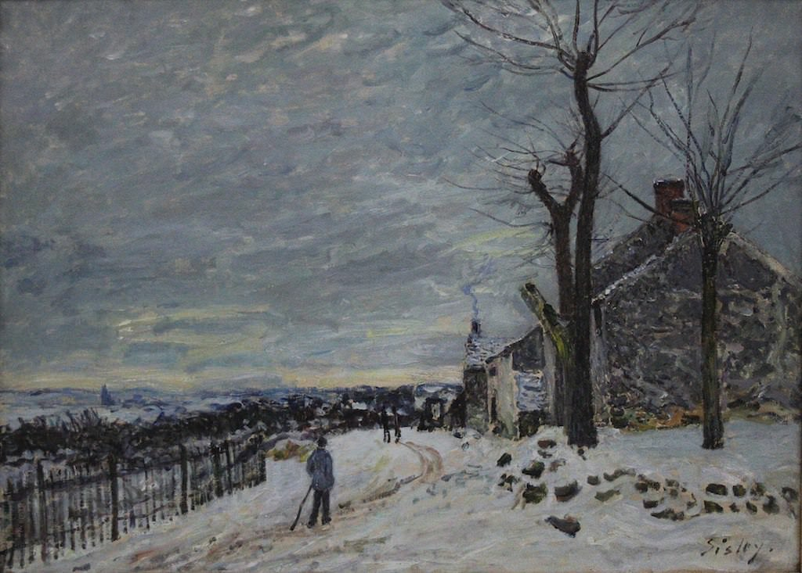

[🏠 Home](../../index.md)

# September 21

## 🧑‍🎨 Painting of the day

[Alfred Sisley](http://en.wikipedia.org/wiki/Alfred_Sisley) (Impressionism)

<button class="btn btn-success"
onclick=" window.open('https://lens.google.com/uploadbyurl?url=https://iretes.github.io/one-a-day/data/img/Alfred_Sisley_1.jpg','_blank')">
Search with Google Lens
</button>

## 🎼 Song of the day

> *Seven Nation Army*
by The White Stripes

 Written by Jack White.

Released in April , 2003.

<button class="btn btn-success"
onclick=" window.open('http://www.youtube.com/search?q=Seven Nation Army by The White Stripes','_blank')">
Search on YouTube
</button>

## 🏛️ UNESCO heritage site of the day

> *Archaeological Area of Agrigento*, Italy

Founded as a Greek colony in the 6th century B.C., Agrigento became one of the leading cities in the Mediterranean world. Its supremacy and pride are demonstrated by the remains of the magnificent Doric temples that dominate the ancient town, much of which still lies intact under today's fields and orchards. Selected excavated areas throw light on the later Hellenistic and Roman town and the burial practices of its early Christian inhabitants.

<button class="btn btn-success"
onclick=" window.open('http://www.google.com/search?q=Archaeological Area of Agrigento','_blank')">
Search on Google
</button>

## 🗺️ Place of the day

<iframe
src="https://www.mapcrunch.com"
name="mapcrunch"
width="500"
height="500"
allowTransparency="true"
scrolling="no"
frameborder="0"
>
</iframe>
## 🎨 Color of the day

> *[Antique brass](https://en.wikipedia.org/wiki/List_of_Crayola_crayon_colors#Standard_colors)*

&#9632;

## 🌿 Plant of the day

> *blackhaw*

<button class="btn btn-success"
onclick=" window.open('http://www.google.com/search?q=blackhaw','_blank')">
Search on Google
</button>

## 🧑‍🔬 Scientific discovery of the day

> *1778: Antoine Lavoisier (and Joseph Priestley): discovery of oxygen leading to end of Phlogiston theory.*

<button class="btn btn-success"
onclick=" window.open('http://www.google.com/search?q=1778: Antoine Lavoisier (and Joseph Priestley): discovery of oxygen leading to end of Phlogiston theory.','_blank')"> 
Search on Google
</button>

## 💭 Philosophical concept of the day

> *[Eternity](https://en.wikipedia.org/wiki/Eternity)*

## 🗣️ Saying of the day

> *Cut and run*

Run away.

## 🏳️‍🌈 International day

International Day of Peace.