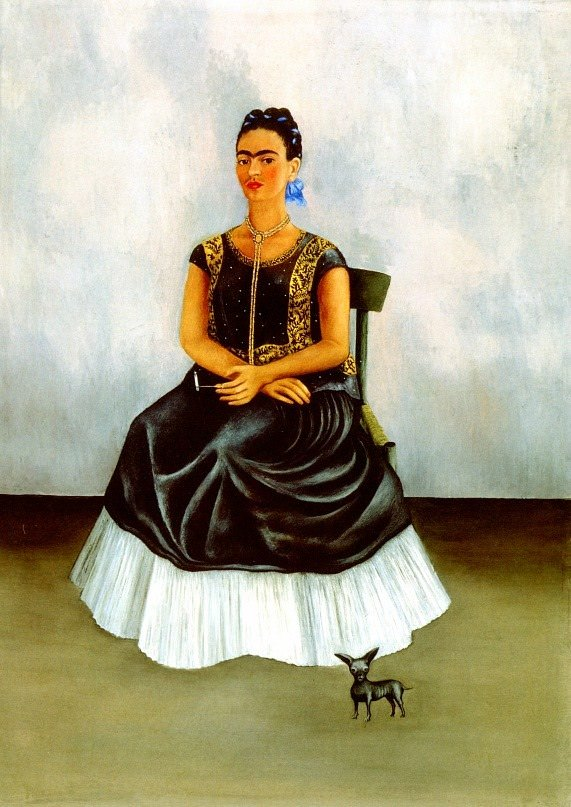

[🏠 Home](../../index.md)

# September 22

## 🧑‍🎨 Painting of the day

[Frida Kahlo](http://en.wikipedia.org/wiki/Frida_Kahlo) (Primitivism, Surrealism)

<button class="btn btn-success"
onclick=" window.open('https://lens.google.com/uploadbyurl?url=https://iretes.github.io/one-a-day/data/img/Frida_Kahlo_6.jpg','_blank')">
Search with Google Lens
</button>

## 🎼 Song of the day

> *Aint No Sunshine*
by Bill Withers

 Written by Withers.

Released in July , 1971.

<button class="btn btn-success"
onclick=" window.open('http://www.youtube.com/search?q=Aint No Sunshine by Bill Withers','_blank')">
Search on YouTube
</button>

## 🏛️ UNESCO heritage site of the day

> *Nord-Pas de Calais Mining Basin*, France

Remarkable as a landscape shaped over three centuries of coal extraction from the 1700s to the 1900s, the site consists of 109 separate components over 120,000&nbsp;ha. It features mining pits (the oldest of which dates from 1850) and lift infrastructure, slag heaps (some of which cover 90&nbsp;ha and exceed 140&nbsp;m in height), coal transport infrastructure, railway stations, workers&rsquo; estates and mining villages including social habitat, schools, religious buildings, health and community facilities, company premises, owners and managers&rsquo; houses, town halls and more. The site bears testimony to the quest to create model workers&rsquo; cities from the mid 19th century to the 1960s and further illustrates a significant period in the history of industrial Europe. It documents the living conditions of workers and the solidarity to which it gave rise.

<button class="btn btn-success"
onclick=" window.open('http://www.google.com/search?q=Nord-Pas de Calais Mining Basin','_blank')">
Search on Google
</button>

## 🗺️ Place of the day

<iframe
src="https://www.mapcrunch.com"
name="mapcrunch"
width="500"
height="500"
allowTransparency="true"
scrolling="no"
frameborder="0"
>
</iframe>
## 🎨 Color of the day

> *[Dark goldenrod](https://en.wikipedia.org/wiki/Goldenrod_(color)#Dark_goldenrod)*

&#9632;

## 🌿 Plant of the day

> *pink corydalis*

<button class="btn btn-success"
onclick=" window.open('http://www.google.com/search?q=pink corydalis','_blank')">
Search on Google
</button>

## 🧑‍🔬 Scientific discovery of the day

> *2016: The LIGO team detected gravitational waves from a black hole merger*

<button class="btn btn-success"
onclick=" window.open('http://www.google.com/search?q=2016: The LIGO team detected gravitational waves from a black hole merger','_blank')">
Search on Google
</button>

## 💭 Philosophical concept of the day

> *[The saying and the said](https://en.wikipedia.org/wiki/The_saying_and_the_said)*

## 🗣️ Saying of the day

> *Pour oil on troubled waters*

Attempt to calm a problematic situation.
