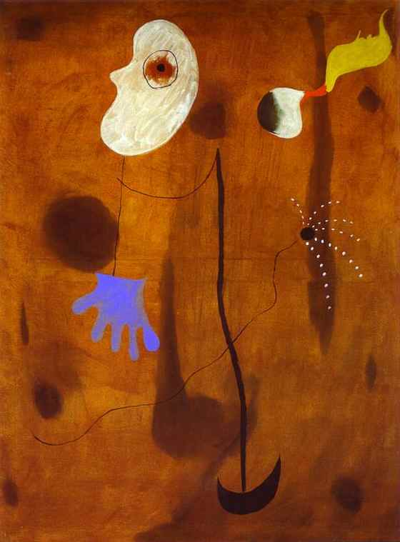

[🏠 Home](../../index.md)

# September 24

## 🧑‍🎨 Painting of the day

[Joan Miro](https://en.wikipedia.org/wiki/Joan_Miró) (Surrealism)

<button class="btn btn-success"
onclick=" window.open('https://lens.google.com/uploadbyurl?url=https://iretes.github.io/one-a-day/data/img/Joan_Miro_8.jpg','_blank')">
Search with Google Lens
</button>

## 🎼 Song of the day

> *Pictures of You*
by The Cure

 Written by Robert Smith, Simon Gallup, Boris Williams, Porl Thompson, Roger O'Donnell, Lol Tolhurst.

Released in May , 1989.

<button class="btn btn-success"
onclick=" window.open('http://www.youtube.com/search?q=Pictures of You by The Cure','_blank')">
Search on YouTube
</button>

## 🏛️ UNESCO heritage site of the day

> *Great Mosque and Hospital of Divriği*, Turkey

This region of Anatolia was conquered by the Turks at the beginning of the 11th century. In 1228–29 Emir Ahmet Shah founded a mosque, with its adjoining hospital, at Divrigi. The mosque has a single prayer room and is crowned by two cupolas. The highly sophisticated technique of vault construction, and a creative, exuberant type of decorative sculpture – particularly on the three doorways, in contrast to the unadorned walls of the interior – are the unique features of this masterpiece of Islamic architecture.

<button class="btn btn-success"
onclick=" window.open('http://www.google.com/search?q=Great Mosque and Hospital of Divriği','_blank')">
Search on Google
</button>

## 🗺️ Place of the day

<iframe
src="https://www.mapcrunch.com"
name="mapcrunch"
width="500"
height="500"
allowTransparency="true"
scrolling="no"
frameborder="0"
>
</iframe>
## 🎨 Color of the day

> *[Pistachio](https://en.wikipedia.org/wiki/Chartreuse_(color)#Pistachio)*

&#9632;

## 🌿 Plant of the day

> *white cornel*

<button class="btn btn-success"
onclick=" window.open('http://www.google.com/search?q=white cornel','_blank')">
Search on Google
</button>

## 🧑‍🔬 Scientific discovery of the day

> *1992: Aleksander Wolszczan and Dale Frail observe the first pulsar planets (this was the first confirmed discovery of planets outside the Solar System)*

<button class="btn btn-success"
onclick=" window.open('http://www.google.com/search?q=1992: Aleksander Wolszczan and Dale Frail observe the first pulsar planets (this was the first confirmed discovery of planets outside the Solar System)','_blank')">
Search on Google
</button>

## 💭 Philosophical concept of the day

> *[Prohairesis](https://en.wikipedia.org/wiki/Prohairesis)*

## 🗣️ Saying of the day

> *April fool*

The
victim of a trick played on April 1st, or the trick itself. 
